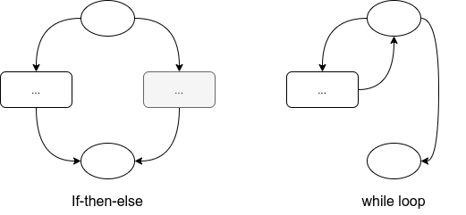
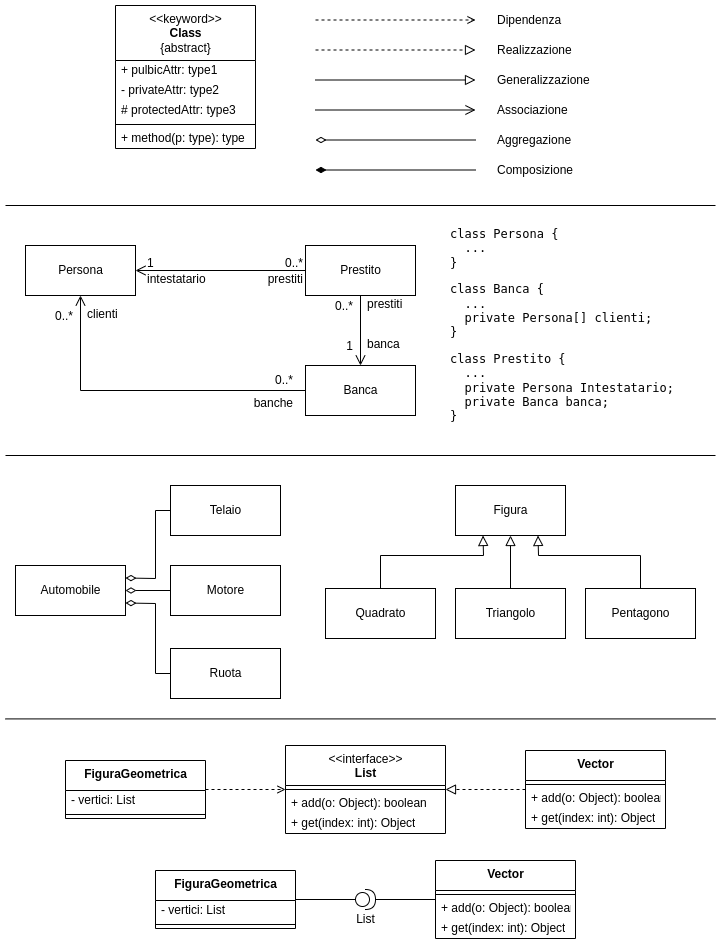
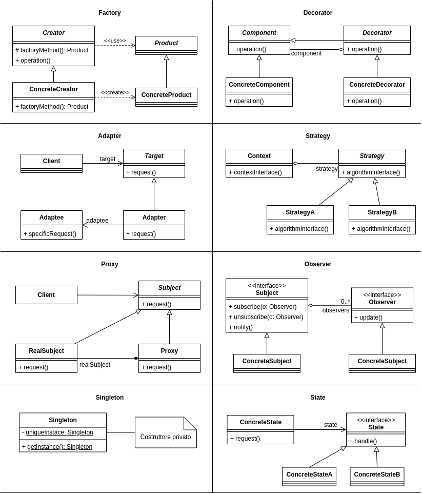
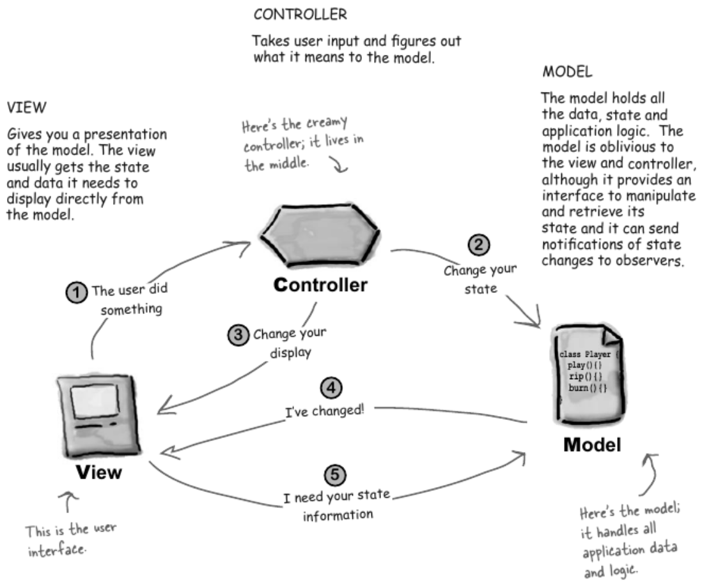

# Appunti di Ingegneria del software per Esame

## Java

### Visibilità

Keyword di visibilità di attributi e metodi:

- `public` - visibile a tutti;
- `private` - visibile solo all'interno della stessa classe;
- `protected` - visibile alle classi dello stesso pacchetto e alle sottoclassi;
- `friendly` - visibile alle classi all'interno dello stesso pacchetto e alle
  sottoclassi all'interno dello stesso pacchetto.

### Riferimenti a primitivi

I tipi primitivi (`int` eccetera) sono valori atomici. Per ottenere dei
riferimenti ad essi usiamo delle classi wrapper: `Integer`, `Character`, `Float`
eccetera. Questi ultimi tipi sono immutabili. Il compilatore permette delle
shorthand per operare tra i primitivi e i corrispettivi oggetti tramite i
meccanismi di boxing e unboxing.

```java
Integer ref1 = new Integer(5); // ref1 punta ad un intero con valore 5
Integer ref2 = ref2; // ref1 e ref2 puntano allo stesso oggetto
ref1 = 10; // Ora ref1 punta ad un nuovo Integer con valore 10 (boxing)
int i = ref1; // i è un primitivo con valore pari al valore di ref1 (unboxing)
```

### Overloading e overriding

In Java è permesso definire più metodi con lo stesso nome, a patto che la lista
segnatura sia diversa: questa pratica è detto overloading. **Nota bene:** il
valore di ritorno non rientra nella segnatura di un metodo. Lo overloading viene
risolto a compile time e quindi fa riferimento al tipo statico dei parametri.

Lo overriding di un metodo è la ridefinizione di un metodo (stessa segnatura e
nome) in una sottoclasse. Lo overriding fa riferimento al tipo dinamico di un
oggetto e viene risolto a runtime.

La regola generale è:

- Controllare il tipo **statico** dei **parametri** per risolvere
  **overloading**
- Controllare il tipo **dinamico dell'oggetto** per risolvere **overriding**

### Classi e metodi generici

```java
// Metodo
public static <E> void printArray(E[] inputArray {
  for(E element : inputArray) {
    System.out.printf("%s ", element);
  }
  System.out.println();
}

// Classe
public class Generic<T> {
  ...

  public T method(T param) {
    ...
  }
}
```

### Multithreading

#### Sincronizzazione

Il principale costrutto di sincronizzazione in Java è il blocco `synchronized`.
È richiesto un oggetto che deterrà il lock. Il blocco `synchronized` assicura
l'atomicità delle operazioni eseguite al suo interno, eventuali thread
concorrenti si metteranno in coda d'attesa per il lock.

```java
// Si può usare anche l'intero oggetto come lock
synchronized(this) {
  ...
}
```

Possiamo anche definire interi metodi come `synchronized`. In questo caso il
lock utilizzato è un lock intrinseco relativo all'oggetto. In questo modo due
chiamate ad un metodo sincronizzato non possono sovrapporsi. I metodi
`static synchronized` usano un altro lock che fa riferimento all'oggetto classe
(`Foo.class`) e non l'istanza. Questo permette a metodi `synchronized` e `static
synchronized` di incrociarsi da loro.

```java
public synchronized void foo() {
  ...
}

public static synchronized void bar() {
  ...
}
```

Un thread può mettersi nella coda di attesa usando il metodo `wait()` chiamato
sull'oggetto che detiene il lock (nel caso di `this` o lock intrinseco il
compilatore lo inferisce). Un thread rimarrà in attesa fino al risveglio dovuto
ad una chiamata a `notify()` o `notifyAll()` sull'oggetto.

```java
public synchronized consumer() {
  while(notReady)
    wait();
  doStuff();
  notReady = true;
}

public synchronized producer() {
  if (notReady) {
    doOtherStuff();
    notReady = false;
    notify(); // o notifyAll();
  }
}
```

#### Lanciare thread

Un modo per costruire un thread è estendendo la classe `Thread`, ridefinendo
il metodo `void run()` e chiamando `Thread.start()` (per aspettare la fine di un
thread usiamo `Thread.join()`). In alternativa possiamo implementare
l'interfaccia `Runnable` (e il metodo `run()`) e passare il nostro `Runnable`
al costruttore di `Thread`. Nota: `Runnable` è un'interfaccia funzionale perciò
`new Thread(() -> { ... })` è legale.

Un metodo più di alto livello per spawnare thread è quello di usare gli
esecutori. Riportiamo un esempio che utilizza una fixed thread pool.

```java
public static main(string[] argv) {
  Runnable r = () -> { ... };
  ExecutorService service = Executors.newFixedThreadPool(n);
  for (int i = 0; i < n; i++)
    service.submit(r);
  s.shutdown(); // Inizia la terminazione dei thread
  s.awaitTermination(1, TimeUnit.MINUTES); // Aspetta che tutti i thread
                                           // concludano con un massimo di tempo
  s.shutdownNow(); // Forza la chiusura dei thread che sono ancora vivi
}
```

#### Future

Un `Future<T>` rappresenta il risultato di una azione asincrona. È provvisto di
metodi per recuperare il valore una volta terminata la computazione, bloccando
se necessario, oppure di controllare se è terminata la computazione. È ritornato
da funzioni tipo `ExecutorService.sumbit()`.

1. `get(long to, TimeUnit u)`: blocca finché la computazione è terminata e ne
   ottiene il risultato;
2. `isDone()`: ritorna vero se il task è completato.

### Functional

La programmazione funzionale in java si basa sul concetto di funzioni lambda e
classi anonime. Snippet di codice:

```java
// Classe anonima
executor.submit(new Callable<Integer>() {
  @Override
  public Integer call() {
    ...
    return 57;
  }
});

// Funzioni lambda
stream.filter(x -> !x.isEmpty());
function((a, b, c) -> {
  function1(a);
  function2(b);
  function3(c);
});
function(a -> obj.func(a)); // equivalente a function(obj::func)
```

Le diverse tipologie di funzioni sono dei particolari tipi, i principali sono:


1. `Predicate<T>`: rappresenta un predicato boolean che prende un argomento di
   tipo `T`;
2. `Consumer<T>`: come `Predicate` ma non ritorna nessun valore;
3. `Function<T,R>`: rappresenta una funzione che accetta un parametro di tipo
   `T` e ritorna un valore di tipo `R`;
4. `BiFunction<T,U,R>`: come, `Function` solo che prende due parametri, uno di
   tipo `T` e uno di tipo `U`.

Le funzioni lambda vengono usate con le interfacce funzionali (vedi `Runnable` e
`Callable`) e gli stream.

#### Stream

Uno stream viene costruito tramite la chiamata a `stream()` su una collection.
Essi permettono di concatenare funzioni come una serie di trasformazioni. Le più
importanti sono:

1. `forEach(Consumer<T>)`: esegue la funzione per ogni elemento;
2. `filter(Predicate<T>)`: ritorna uno stream contente solo gli elementi che
   soddisfano il predicato;
3. `map(Function<T,U>)`: esegue la funzione su ogni elemento e ne salva il
   risultato;
4. `flatMap(Function<T, Stream>)`: "appiattisce" un insieme di collection in un
   unico stream di oggetti;

   ```java
   // [[1,2,3],[4,5],[6]]] -> [1,2,3,4,5,6]
   listOfLists.stream().flatmap(x -> x.stream());
   ```

5. `distinct()`: rimuove duplicati;
6. `sort(Comparator<T>)`: ordina lo stream;
7. `reduce(T identity, BinaryOperator<T> accumulator)`: esegue una riduzione
   degli elementi dello stream, utilizzando il valore di identità fornito e una
   funzione associativa di accumulazione;
8. `collect(Collector<T,A,R>)`: come `reduce`, ma salva il risultato in un
   contenitore mutabile utilizzando `Collector`.

#### Optional

Il tipo `Optional<T>` nasconde il fatto che un elemento possa essere `null`.
Sono disponibili i seguenti metodi:

1. `of(T val)`: crea un optional con valore `val`;
2. `empty()`: crea un optional vuoto;
3. `ifPresent(Consumer<T>)`: se è presente un valore, viene passato a
   `Consumer`;
4. `flatMap(Function<T, Optional<U>>)`: se `empty()` ritorna, altrimenti esegue
   `Function`;
5. `orElse(T val)`: se non è vuoto viene riportato il valore, altrimenti `val`.

## JML

### Astrazione procedurale

Fa riferimento alle **funzioni statiche**. Queste direttive verranno usate anche
per altro con alcune aggiunte.

Le direttive sono:

- `requires`: specifica delle precondizioni (tutto ciò che deve essere vero
  prima dell'esecuzione);
- `ensures`: specifica delle postcondizioni (tutto ciò che sarà vero dopo
  l'esecuzione);
- `assignable`: specifica che il dato parametro verrà modificato durante
  l'esecuzione (side-effect), se omesso è inteso `assignable \nothing`;
- `signals`: specifica le condizioni sotto le quali verrà lanciata
  l'eccezione specificata

Oltre alla normale sintassi java sono specificate le seguenti espressioni:

- `\result`: utilizzabile nella `ensures`, rappresenta il valore ritornato dalla
  funzione;
- `\old(exp)`: utilizzabile nella `ensures`, è il valore di `exp` valutata prima
  della chiamata alla funzione;
- `pure`: specifica che un metodo non ha side-effects;
- `==>, <==, <==> <=!=>`: i vari tipi di implicazione;
- `(* comment *)`: commenti in linguaggio naturale, vengono valutati sempre come
  `true`;
- `(\forall variable; range; condition)`: quantificatore universale di
  `condition` su `range`;
- `(\exists variable; range; condition)`: quantificatore esistenziale di
  `condition` su `range`;
- `(\num_of variable; range; condition)`: la cardinalità dell'insieme di
  variabili in `range` che rispetta `condition`;
- `(\sum variable; range; condition)`: sommatoria degli elementi di `range` che
  soddisfano `condition`;
- `(\product variable; range; condition)`: produttoria degli elementi di `range`
  che soddisfano `condition`;
- `(\max variable; range; condition)`: massimo degli elementi di `range` che
  soddisfano `condition`;
- `(\min variable; range; condition)`: minimo degli elementi di `range` che
  soddisfano `condition`;

### ADT

Relativo alla specifica di **metodi non statici**.

Lo stato interno dell'oggetto può essere osservato solo tramite metodi puri. I
metodi sono così categorizzati:

- **Creatori**: Producono nuovi oggetti;
- **Produttori**: Dati oggetti del loro stesso tipo ne producono altri del
  loro tipo;
- **Modificatori**: Modificano oggetti del proprio tipo;
- **Osservatori**: Dati oggetti del loro stesso tipo, ritornano dei risultati di
  altri tipi.

Un tipo è detto **immutabile se non ha metodi modificatori**.

Possiamo definire oggetti come liste col fine di dare un modello comportamentale
al ADT che stiamo specificando. Questo ci permette di creare specifiche più
concise, senza perdere tempo a specificare il comportamento di liste o altri ADT
già conosciuti. Per specificare un Typical Abstract Object usiamo
`spec_public Type<T> name`.

Un oggetto può avere **proprietà evolutive** e **invarianti**. Le prime non sono
facilmente esprimibili in JML, le altre invece sono esprimibili tramite la
direttiva `public invariant`. **Una classe immutabile rispetterà sempre
l'invariante se il costruttore crea istanze corrette**. Per le classi
**mutabili** dobbiamo dimostrare che **i modificatori mantengono vero
l'invariante**.

La **rappresentazione concreta di un ADT è detta rep**. La **funzione di
astrazione**, solitamente il `toString()`, mappa gli **stati concreti con quelli
astratti**. La funzione di astrazione **può non essere né totale né iniettiva**.

**La funzione di astrazione è definita solo per stati concreti validi**. Per
**definire se uno stato concreto è valido o no usiamo il rep invariant**,
definito tramite la direttiva `private invariant`. Il rep invariant può accedere
a campi privati della classe.

### Ereditarietà

È detta estensione in JML. Una estensione è detta **pura quando non modifica il
comportamento dei metodi ereditati**, può quindi aggiungere nuovi metodi e
modificare l'implementazione di quelli esistenti purché sia invariata la
specifica. La funzione di astrazione e rep sono solitamente conservati. Il rep
invariant può essere esteso usando la direttiva `also`.

Le **estensioni pure sono sempre sicure**, quelle non pure devono rispettare il
principio di sostituzione di Liskov.

#### Principio di sostituzione di Liskov

Una sottoclasse deve rispettare il contratto della sopraclasse. Per garantire
ciò dobbiamo rispettare 3 regole:

1. **Regola della segnatura**: Il sottotipo deve avere tutti i metodi della
   sopraclasse e le segnature dei metodi del sottotipo devono essere
   compatibili.
2. **Regola dei metodi**: Le chiamate ai metodi del sottotipo devono avere lo
   stesso comportamento di quelle ai metodi del sopratipo.
3. **Regola delle proprietà**: I metodi del sottotipo devono mantenere
   invarianti e proprietà evolutive del sopratipo.

La prima regola è verificata staticamente del compilatore. È permessa
controvarianza per i parametri e covarianza per il valore di ritorno. In java
siamo costretti a garantire l'uguaglianza della segnatura (nota: il valore di
ritorno non fa parte della segnatura, quindi vale la covarianza).

La seconda regola è invece controllata da JML e impone che:

1. **Le precondizioni debbano essere indebolite**;
2. **Le postcondizioni debbano essere rafforzate**;
3. Le **eccezioni** siano rimosse solo se sono **inutili per quanto
   riguarda il sottotipo o opzionali**.

In JML possiamo estendere precondizioni e postcondizioni usando `also`. **La
nuova clausola `requires` viene messa in `OR` con quella ereditata, mentre la
`ensures` è messa in `AND`**.

Per la terza regola bisogna dimostrare che i nuovi metodi aggiunti e quelli di
cui si è fatto override conservano gli invarianti e le proprietà evolutive del
sopratipo.

## Testing

Metodi di test black-box:

1. **Testing guidato dalla sintassi**: test basato su una grammatica formale
2. **Testing guidato dagli scenari d'uso**: basato su UML case-diagram
3. **Derivazione dalle specifiche**: basato su linguaggi formali di specifica
4. **Boundary conditions**: testare le condizioni agli estremi del dominio di
   definizione

Tipi di coverage:

1. **Statement coverage**: ogni istruzione viene eseguita una volta
2. **Edge coverage**: tutti i rami del CFG sono attraversati almeno una volta,
   implica statement coverage;
3. **Edge and condition coverage**: bisogna attraversare tutti i rami del CFG
   almeno una volta stimolare ogni possibile combinazione degli atomi delle
   condizioni composte, implica edge coverage;
4. **Path coverage**: ogni possibile cammino percorribile deve essere percorso,
   implica edge coverage.

{ width=50% }

## Appendice






