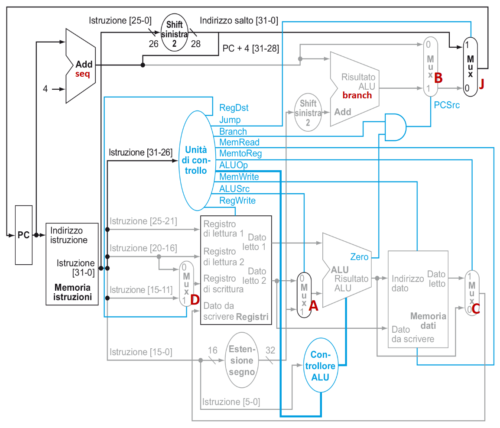
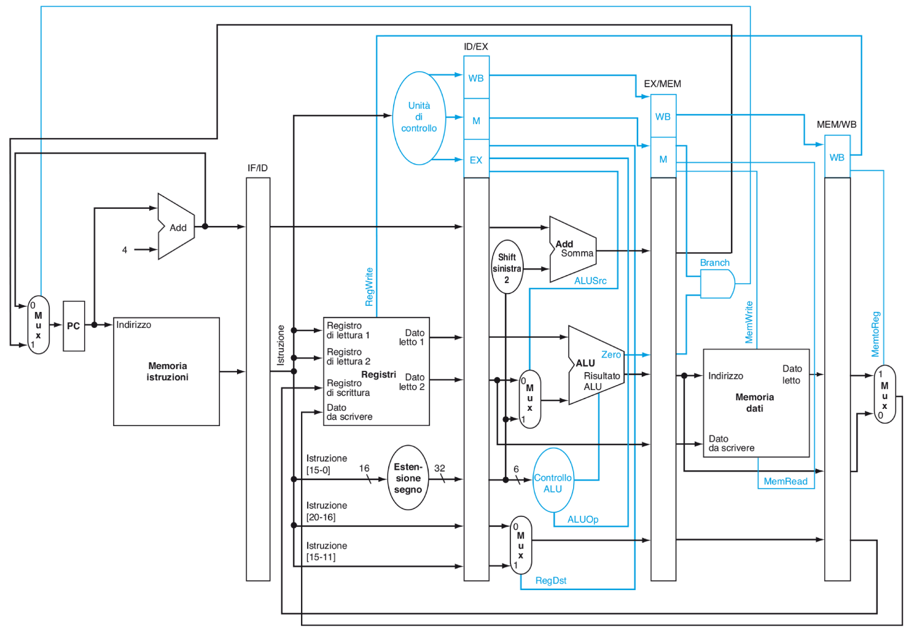
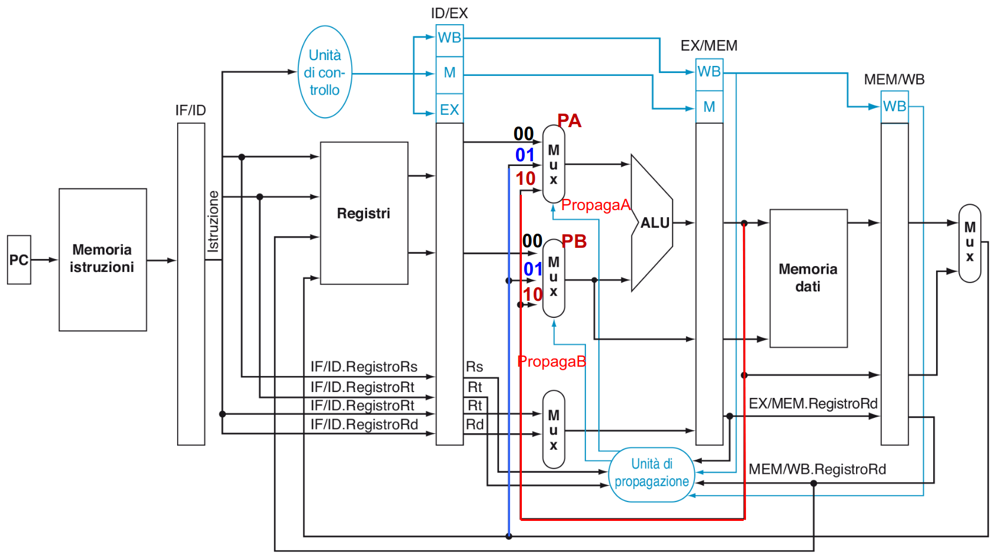
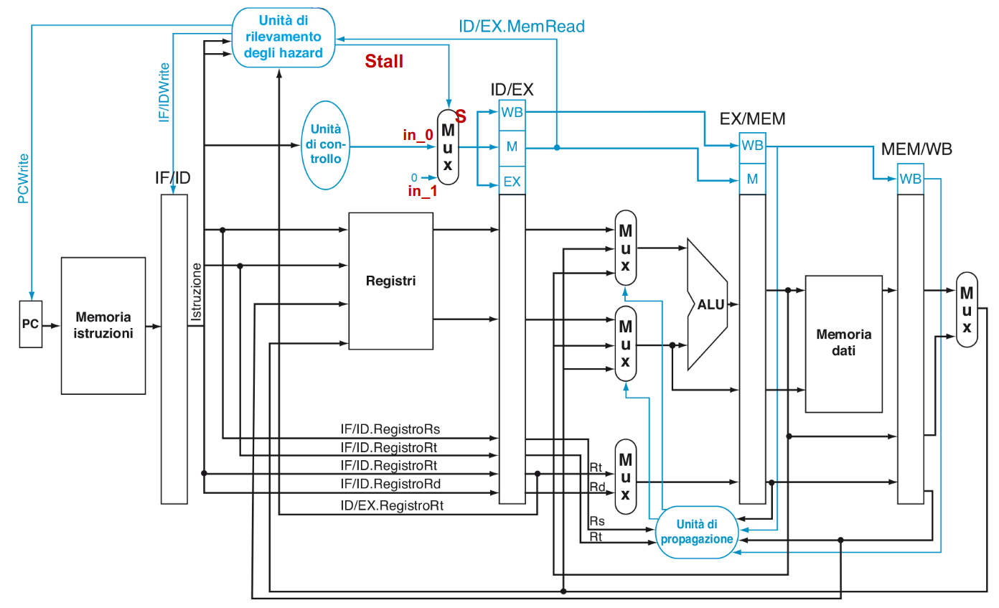
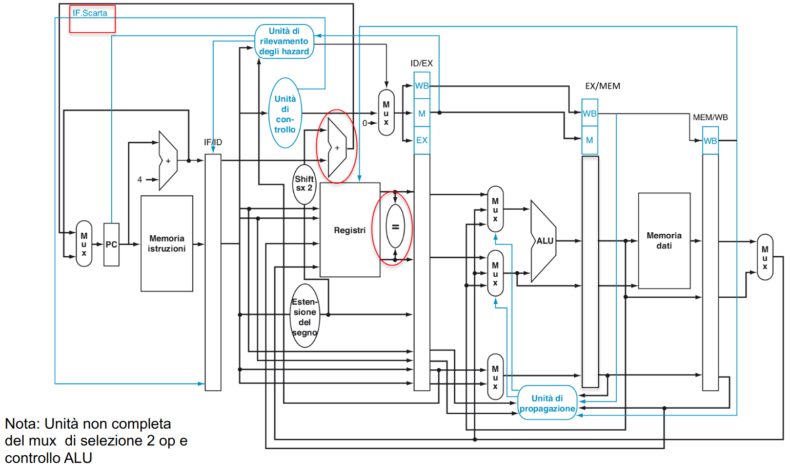
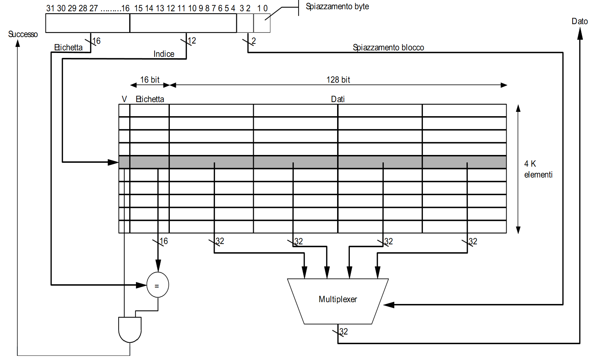
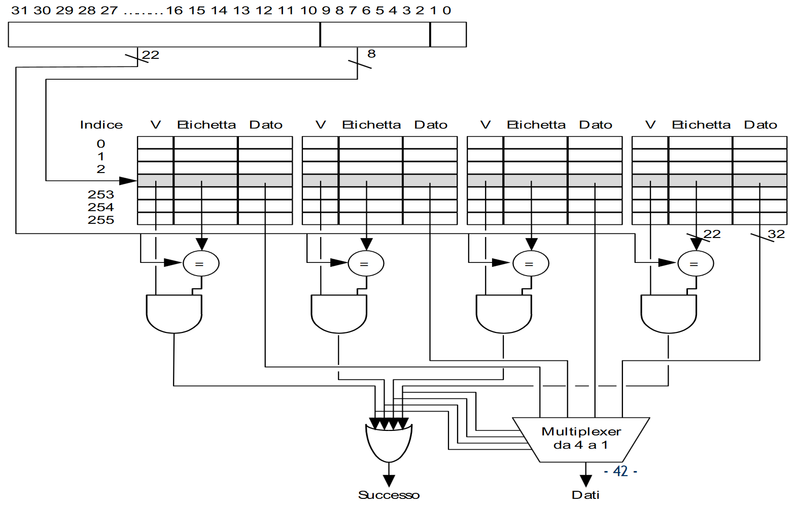
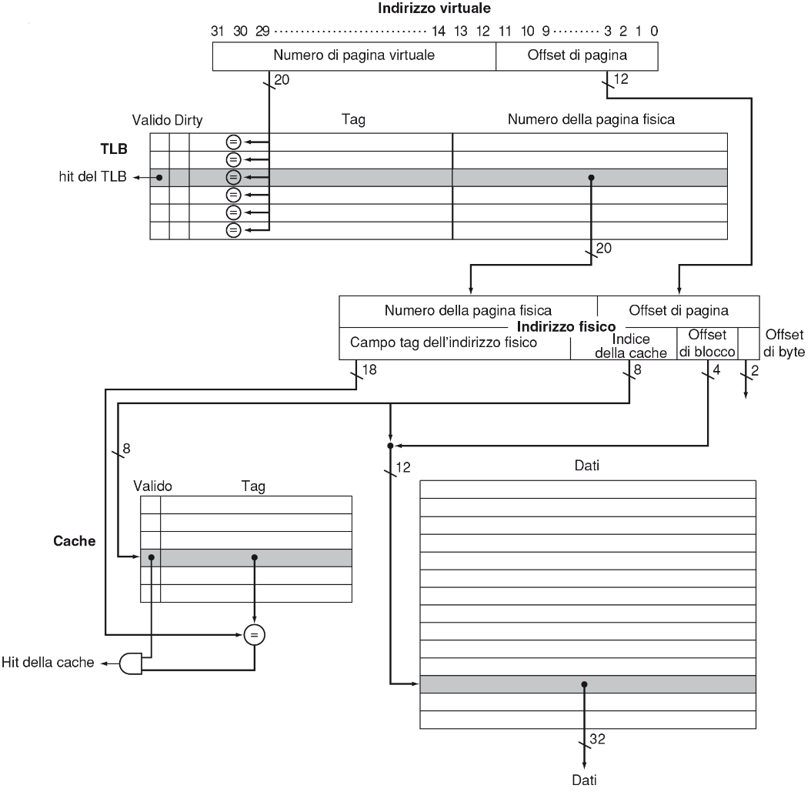
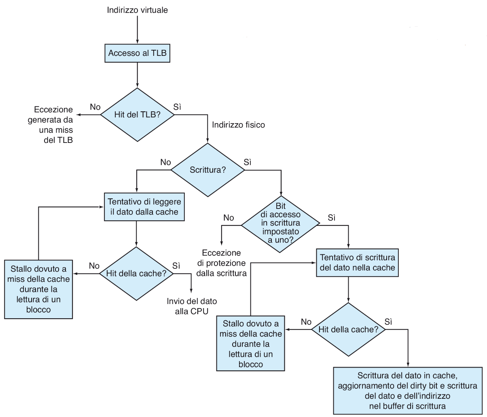

# Appunti ACSO

## I principi fondamentali

I processori eseguono le istruzioni in maniera sequenziale (non vedremo la Out
of Order Execution). Il processore contiene una sezione di controllo che
controlla l'esecuzione leggendo le istruzioni dalla memoria. I vari programmi
da eseguire sono salvati in una memoria.

L'architettura di riferimento è l'architettura di Von Neumann. Esso contiene:

- Processore
  - Sezione di controllo
  - ALU
  - Registri
- Memoria
- Interfacce I/O
- Bus che collega i vari componenti sopra elencati

I registri sono delle piccole celle di memoria che il processore usa per
salvare dati utili. Ogni registro ha una dimensione massima specificata in bit.
I registri che studieremo saranno quelli a 32 bit.

Viene detta parola del processore la lunghezza dei suoi registri, ossia la
lunghezza massima della sequenza di bit che può gestire.

Esistono dei registri particolare:

- PC (Program Counter): contiene l'indirizzo della prossima istruzione
  in memoria
- IR (Instruction Register): contiene l'intera istruzione da eseguire

Il ciclo di esecuzione di un'istruzione è divisa nelle seguenti fasi:

- fetch: viene presa dalla memoria attraverso il bus l'istruzione puntata dal
  program counter e incrementalo nel frattempo (memoria più lenta del
  processore)
- decode: decodifica l'istruzione e prepara l'esecuzione prelevando gli operandi
- execute: esegui e memorizza i risultati

I vari processori si differenziano in base alla lunghezza delle istruzioni che
usano (può essere una singola parola (RISC) oppure più (CISC)).

### Data path

Il data path è formato da registri e da ALU. I registri sono divisi in:

- utilizzabili dall'assembler
- di supporto per altri componenti (es.: 3 registri di supporto dell'ALU
  (sorgente, sorgente, destinazione))

Abbiamo due classi di istruzioni:

- Prendono registri e memorizzano in altri registri (registro-registro)
- Gestiscono lo spostamento da registri a memoria (registro-memoria)

L'esecuzione di una istruzione registro-registro viene detta ciclo di data path.
Il ciclo di data path è collegato al ciclo di clock.

### Codifica delle istruzioni

Ogni istruzione è divisa in codice operativo e campi (field). Il codice
operativo indica il tipo di operazione. I campi vengono usati per gli operandi
dell'istruzione.

Le modalità di indirizzamento descrivono le diverse modalità attraverso le cui
far riferimento agli operandi nelle istruzioni.

### Architettura LOAD/STORE

Il numero di registri ad uso generale non è abbastanza grande per mantenere
tutte le variabili di un programma. Ad ogni variabile viene quindi assegnata una
locazione in memoria nella quale salvare il contenuto del registro che la
rappresenta quando deve essere usato per altro.

Poiché gli operandi delle istruzioni possono provenire solamente dai registri
ad uso generale, servono delle istruzioni di caricamento e salvataggio a
memoria. Da qui il nome dell'architettura.

### Interruzioni (interrupt)

Il normale flusso dei programmi può essere interrotto attraverso le
interruzioni. Quando un dispositivo esterno vuole richiedere l'attenzione del
processore, esso attiva un segnale hardware (segnale di interrupt) per
notificarlo.

Il check degli interrupt viene fatto alla fine dell'esecuzione di
un'istruzione ma prima del fetch della successiva. Se viene trovato un segnale
di interrupt, il processore interrompe la normale esecuzione del programma ed
esegue la richiesta. Una volta gestita il processore torna ad eseguire
normalmente il suo programma.

### La gerarchia di memoria

E' divisa in una gerarchia (dalla più veloce alla più lenta):

- Registri
- Cache (L1, L2, L3)
- Memoria fisica: RAM (es. DDR-SDRAM)
- Memoria a stato solido (SSD)
- Memoria virtuale: basata su file (HDD)

### Indirizzi di memoria principale

La memoria principale è suddivisa in celle. La dimensione di una cella è
chiamata parola, come anche il numero massimo di bit che il processore può
gestire. La parola di memoria non per forza avrà la stessa dimensione della
parola del processore.

Nel MIPS useremo una parola di memoria di 8 bit (memoria indirizzabile al byte).
Di conseguenza una parola MIPS è lunga 4 parole di memoria.

Il tempo di indirizzamento di ogni singola parola è uguale.

L'insieme di tutte le celle di memoria indirizzabili con 1 parola di processore
è detto spazio di memoria: per una parola di 32 bit si ha uno spazio di memoria
di 4 GB.

### Bus di sistema

Un bus è un insieme di fili. Ogni filo trasferisce un bit. I vari fili sono
suddivisi in categorie:

- Bus dati: comprende le linee usate per trasferire dati da/verso memoria.
  La dimensione del bus dati deve essere abbastanza da garantire il
  trasferimento contemporaneo di una o più parole di memoria
- Bus indirizzi: comprende le linee sulle quali la CPU procede a trasmettere
  gli indirizzi di memoria delle risorse
- Bus di controllo: comprende le linee su cui transitano le informazioni
  ausiliarie per la corretta definizione delle operazioni e per sincronizzare
  CPU e memoria

Il bus può essere utilizzato per un solo trasferimento alla volta: in ogni
istante solo due entità possono comunicare (master - slave). Il master è il
processore, gli slave sono le periferiche. Il processore regola l'accesso delle
varie periferiche. L'unico filo che può essere usato senza permesso del
processore è quello di interrupt request.

L'architettura a bus singolo è molto flessibile e semplice. I dispositivi, però,
hanno velocità diverse. Serve, quindi, un meccanismo di sincronizzazione tra le
varie periferiche.

#### Esempio: operazione di lettura da memoria

1. CPU fornisce l'indirizzo della parola desiderata sul bus indirizzi e richiede
  la lettura sul bus di controllo
2. Quando la memoria ha completato la lettura della parola richiesta, il dato
  viene trasmesso sul bus dati

## MIPS assembler

Il linguaggio assembler è simbolico. E' il primo livello di astrazione prima
del linguaggio macchina.

Un programma è composto da più file (oggetti). Il compito di "collegare" i vari
oggetti è delegato al linker.

L'assembler non istruzioni che effettuano un controllo di flusso come inteso in
C. L'unico strumento che ha è il jump/branch che permette di saltare da
un'istruzione all'altra.

### Sintassi

Nel MIPS i registri sono numerati da 0 a 31 e hanno dei nomi simbolici.
Vengono identificati dal simbolo `$`. Mettere un registro tra parentesi tonde
effettua un'operazione di indirezione. Il primo registro nei field è quasi
sempre la destinazione del risultato dell'istruzione.

#### Direttive

I comandi che iniziano con `.` sono direttive del preprocessore. Esse sono:

- `.text` o `.data`: indica che le linee successive sono istruzioni o dati
- `.align n`: specifica l'allineamento a 2^n bit
- `.globl main`: indica che l'etichetta `main` è visibile anche in altri file
  (visibilità globale)
- `.aciiz`: specifica un'area di memoria che contiene una stringa ASCII
  terminata da `\0`
- `.space n`: riserva uno spazio di n byte
- `.word n`: equivalente a `.space 4` e settare a `n`
- `.half n`:  equivalente a `.space 2` e settare a `n`
- `.byte n`:  equivalente a `.space 1` e settare a `n`
- `.eqv A, n`: equivalente alla `#define` del C

#### Registri

Essi sono 32, numerati da 0 a 31 (occupa 5 bit). Ogni istruzione, quindi, può
usare 3 registri alla volta. Gli operandi delle istruzioni devono essere prima
salvati nei registri.

Registri referenziabili:

- `$0`: contiene sempre 0
- `$1`/`$at`: riservato
- `$v0` e `$v1`: usati per risultati di funzioni e calcolo espressioni
- `$a0` - `$a3`: usati per il passaggio di argomenti
- `$t0` - `$t7`: variabili temporanee
- `$s0` - `$s7`: variabili da preservare
- `$k0` e `$k1`: riservati al kernel
- `$gp`: global pointer (punta ad area di dati globale/statica)
- `$sp`: stack pointer
- `$fp`: frame pointer (puntatore ai frame funzione; in aiuto a `$sp`)
- `$ra`: return address utilizzato nelle chiamate di funzione

Registri non referenziabili:

- `$pc`: program counter
- `$hi`: registro per moltiplicazione/divisione
- `$lo`: registro per moltiplicazione/divisione

#### Istruzioni

Le istruzioni si dividono in 4 categorie:

1. istruzioni aritmetico logiche
2. istruzioni di trasferimento da/verso memoria (ad es. `lw` e `sw`)
3. istruzioni di salto condizionato/incondizionato
4. istruzioni di ingresso/uscita (non fornite da tutti gli assembler)

Le istruzioni sono tutte lunghe massimo 32 bit. I 6 bit più significativi si
chiamano "codice operativo" (OPCODE) e indica il tipo di istruzione.

In MIPS ci sono 3 tipi di istruzioni:

- tipo R: istruzioni aritmetico-logiche; strutturate in:

  ```txt
      6        5        5        5         6       5
  +--------+--------+--------+--------+--------+--------+
  | OPCODE |   rs   |   rt   |   rd   |   sa   | funct  |
  +--------+--------+--------+--------+--------+--------+
  ```

- tipo I: istruzioni di accesso alla memoria o contenenti costanti

  ```txt
      6        5        5                 16
  +--------+--------+--------+--------------------------+
  | OPCODE |   rs   |   rt   |           const          |
  +--------+--------+--------+--------------------------+
  ```

- tipo J: salto

  ```txt
      6                        26
  +--------+--------------------------------------------+
  | OPCODE |                jump target                 |
  +--------+--------------------------------------------+
  ```

Sintassi:

```mips
istruzione field1, field2, field3 # comment
```

La lista completa di tutte le istruzioni non è riportata qui. Può essere trovata
nella cartella con il materiale del corso.

##### Istruzioni aritmetico-logiche

| istruzione | campo | campo |  campo  |
|------------|-------|-------|---------|
| `add`      | `rd`  | `rs`  | `rt`    |
| `addu`     | `rd`  | `rs`  | `rt`    |
| `addi`     | `rd`  | `rs`  | `const` |
| `addui`    | `rd`  | `rs`  | `const` |
| `sub`      | `rd`  | `rs`  | `rt`    |
| `subu`     | `rd`  | `rs`  | `rt`    |
| `subi`     | `rd`  | `rs`  | `const` |
| `subui`    | `rd`  | `rs`  | `const` |
| `mult`     | `rs`  | `rt`  | -       |
| `multu`    | `rs`  | `rt`  | -       |
| `div`      | `rs`  | `rt`  | -       |
| `divu`     | `rs`  | `rt`  | -       |

Le istruzioni immediate (`*i`) hanno la peculiarità di prendere una costante al
posto di un secondo registro. Per come è strutturato il formato delle istruzioni
immediate, la costante sarà di massimo 2^16.

Il registro di destinazione della `mult` è implicito: il risultato viene
salvato in `$hi` (32 cifre più significative) e `$lo` (32 cifre meno
significative). Per spostare il risultato da questi due registri viene usato
`mfhi rd` e `mflo rd`. Stessa cosa vale per la divisione solo che il quoziente
è posto nel registro `$lo`, mentre il resto in `$hi`.

##### Trasferimenti in memoria

| istruzione | campo | campo       |
|------------|-------|-------------|
| `lw`       | `rt`  | `const(rs)` |
| `sw`       | `rt`  | `const(rs)` |
| `la`       | `rt`  | `const`     |

La parte `const(rs)` serve a calcolare l'indirizzo di memoria a cui
si fa riferimento. L'indirizzo di memoria è pari a
`const + indirizzo contenuto in rs`. Per come è strutturata il tipo
di istruzione I, posso caricare/salvare nell'intervallo `[-2^15 ; +2^15 -1]`
rispetto al registro base.

In memoria una `lw` o una `sw` avranno questo formato:

```txt
    6        5        5                 16
+--------+--------+--------+--------------------------+
| OPCODE |   rs   |   rt   |           const          |
+--------+--------+--------+--------------------------+
```

L'istruzione `la` è una pseudo istruzione: poiché gli indirizzi sono di 32 bit,
non è possibile specificare un intero indirizzo in un'istruzione.
L'assemblatore, allora, espande la `la` in 2 istruzioni:

- si utilizza `lui $rt const` per caricare i 16 bit più significativi in
  `$at` (mettendo a 0 gli altri 16 bit meno significativi)
- si utilizza un'altra istruzione (`ori` un esempio) per caricare gli altri
  bit meno significativi e spostare tutto nel registro di destinazione

Un'altra pseudo istruzione simile è `li $rt, const`.

L'ordinamento dei byte di una parola non è da dare per scontato:

- big-endian: ordinamento da sinistra a destra
- little-endian: ordinamento da destra a sinistra

Il MIPS può operare con entrambe le modalità.

###### Load e store con indirizzi simbolici

Nelle chiamate a `lw` e `sw` si può omettere il registro base. In quel caso
verrà usato `$gp` e l'offset verrà calcolato dal linker.

```mips
.data
...
A: .word
...

.text
...
    lw $t0, A
    # viene assemblato in
    #   lw $t0, %gp_rel(A)($gp)
    # dove %gp_rel(A) è una direttiva del linker che calcola l'offset di A da
    # $gp
```

Anche `la` possiede una forma simile: i bit più significativi e meno
significativi non sono calcolati dal compilatore, ma il compito viene delegato
al linker:

```mips
.data
...
A: .word
...

.text
...
    la $t0, A
    # viene assemblato in:
    #   lui $t0, %hi(A)
    #   addiu $t0, %lo(A) # oppure ori $t0, %lo(A)
    # dove come prima %hi(A) e %lo(A) sono direttive del linker
```

Queste forme vanno usate solo con valori dichiarati con `.word`, `.half` e
`.byte`.

Per più dettagli vedi la sezione sulla compilazione e assemblaggio.

##### Istruzioni logiche

| istruzione | campo | campo | campo |
|------------|-------|-------|-------|
| `and`      | `rd`  | `rs`  | `rt`  |
| `or`       | `rd`  | `rs`  | `rt`  |
| `nor`      | `rd`  | `rs`  | `rt`  |
| `sll`      | `rd`  | `rs`  | `sa`  |
| `srl`      | `rd`  | `rs`  | `sa`  |

`sll` di 1 bit equivale a moltiplicare per 2. `srl` di 1 bit equivale dividere
per 2.

L'istruzione `not` viene eseguita con usando `nor $rd $rs $0`.

Esistono anche le varianti immediate per `and`, `or` e `nor`.

##### Istruzioni di modifica del flusso

Le istruzioni di modifica del flusso servono a forzare la modifica del `$pc`,
rompendo il flusso sequenziale standard. Il salto condizionato viene chiamato
branch, quello incondizionato jump.

###### Branch

Le istruzioni di branch hanno tutte la forma:

```mips
branch_condizione rs, rt, offset
```

Le istruzioni di branch sono di tipo I. Avrò quindi a disposizione un salto di
`[-2^15 ; +2^15 -1]` (salvato a complemento a 2) parole. Il salto però viene
effettuato relativo al program counter. Il principio di località degli
indirizzi, però, ci viene in aiuto: i programmi lavorano solo su segmenti vicini
di indirizzi. La probabilità di saltare verso indirizzi più distanti di 2^15-1 è
molto bassa.

| istruzione | campo | campo | campo  | condizione |
|------------|-------|-------|--------|------------|
| `beq`      | `rs`  | `rt`  | offset | `rs == rt` |
| `bne`      | `rs`  | `rt`  | offset | `rs != rt` |

L'assemblatore, a un'etichetta messa nel campo offset, sostituisce
`(L-(PC+4))/4`.

Per verificare diseguaglianze usiamo le seguenti istruzioni ausiliarie. Esse
caricano 1 nel registro destinazione se la condizione è avverata e 0 altrimenti.

| istruzione | campo | campo | campo | condizione |
|------------|-------|-------|-------|------------|
| `slt`      | `rd`  | `rs`  | `rt`  | `rs < rt`  |
| `sltu`     | `rd`  | `rs`  | `rt`  | `rs < rt`  |

Queste istruzioni sono di tipo R. Esistono anche le varianti immediate di
queste istruzioni.

###### Jump

Sono possibili 3 salti assoluti:

| istruzione | campo  |
|------------|--------|
| `j`        | offset |
| `jal`      | offset |
| `jr`       | `rs`   |

Nel campo offset rizzo posso salvare fino a 26 bit. Poiché le
istruzioni hanno allineamento 4, i due bit meno significativi saranno sempre
`00`. Posso, quindi, ignorare questi due bit salvando escludendo i due bit meno
significativi ottenendo un salto totale di 2^28 indirizzi (ossia 2^26 parole).
A runtime il processore farà uno shift di due a sinistra il campo indirizzo e lo
concatenerà ai 4 bit più significativi del program counter, ottenendo
l'indirizzo di salto.

Per saltare a indirizzi superiori a 2^28 Byte devo usare la `jr`.

La `jal` salva `$pc + 4` nel registro `$ra` prima di saltare. Essa viene usata
per implementare la chiamata a funzione. La `jr` invece viene usata per
implementare il ritorno al chiamante (`jr $ra`).

Nota bene: anche i salti hanno delle restrizioni sull'indirizzo
(26 bit dedicati)

##### Gestione delle costanti

Se usiamo costanti di 32 bit, l'assemblatore deve fare 2 passi per caricarla:
deve separare la costanti in due parti di 16 bit e trattarle con due istruzioni
separate. Proprio come `la`, esiste la pseudo istruzione `li $rs, const` che
esegue gli stessi passaggi.

#### Modalità di indirizzamento

In MIPS ci sono 5 modalità di indirizzamento:

- Immediato (quello usato dalle istruzioni di tipo I)
- A registro (quello usato dalle istruzioni di tipo R)
- Con base e offset (quello usato da `lw`/`sw`)
- Relativo al program counter (quello usato da `beq`)
- Pseudo diretto (quello usato da `jr`)

#### Etichette

Le etichette vengono usate per dare nomi simbolici a delle celle di memoria.
Sarà compito dell'assemblatore tradurre le etichette in indirizzi di memoria.
Sintassi:

```mips
etichetta:
    add $1, $2, $3 # anche direttiva
```

## Traduzione da C a MIPS

Per tradurre da un linguaggio sorgente a un linguaggio macchina, bisogna
definire un modello di architettura runtime. Alcune delle convenzioni di questo
modello sono:

- collocazione e ingombro di tipi di variabili
- destinazione di uso dei registri

### Modello di memoria

La memoria di un programma è divisa in vari segmenti:

- text (`.text`): codice del programma (dichiarato dal programma)
- data (`.data`): dati statici e dinamici (dichiarato del programma)
- stack: la stack del processo (allocato dal sistema operativo)

```txt
 0x7ffffffc ----------
                        Stack
            ----------
                v


                ^
            ----------
                        Dynamic Data
                        Static Data
 0x10000000 ----------
                        Text
   0x400000 ----------
                        Riservato
        0x0 ----------
```

Gli indirizzi di impianto dei segmenti sono indirizzi virtuali, non fisici.

Programmi molto grandi e sofisticati possono avere due o più segmenti dati o
testo, segmenti di dati condivisi, segmenti di libreria dinamica e altro.

### Syscall

La `syscall` è un'istruzione che passa il controllo al kernel. Il kernel offre
vari servizi, ognuno indentificato da un codice.

Il codice, prima, viene salvato dal chiamante nel registro `$v0`, seguito dagli
argomenti in `$a*` o `$f12`. Viene poi chiamata l'istruzione `syscall`.

Se una `syscall` ritorna un valore, esso viene salvato nel registro `$v0`, anche
`$f0` se è più grande di 32 bit.

### Dimensioni delle variabili

| tipo    | dimensione (B) |
|---------|----------------|
| `char`  | 1              |
| `short` | 2              |
| `int`   | 4              |
| `void*` | 4              |

Per dichiarare un array allochiamo semplicemente `n*dimensione` byte. Per
accederci, usiamo l'aritmetica dei puntatori (come si fa anche in C):
`base + (dimensione * n)`.

Una sintassi alterativa di `.word` è: `.word n, m,...`. Essa equivale
all'inizializzazione diretta di un array (come in C)

Per dichiarare una `struct`, basta semplicemente allocare una dimensione di pari
alla dimensione totale della `struct.` Per accedere ai vari elementi,
semplicemente ci accede come ad un array, tenendo conto dell'ordine degli
elementi.

### Classi di variabili

In C abbiamo diversi tipi di variabili: globali, locali, parametri e allocate
dinamicamente.

#### Variabili globali

Le variabili globali sono allocate in `.data` a partire da 0x10000000. Per
indirizzarla usiamo un'etichetta che gli assegniamo.

Per puntare al segmento dati statici usiamo il registro `$gp`, inizializzato
all'indirizzo 0x10008000

#### Variabili locali

Per le variabili locali posso usare i registri `$s*`. Se, però, ho bisogno di
usare l'indirizzo di una variabile locale, essa andrà salvata sulla stack.

#### Parametri

I primi quattro parametri vengono passati tramite i registri `$a*`. Se la
funzione ha più di 4 parametri essi vengono salvati sulla stack.

Nota bene: per array e struct viene passato l'indirizzo!

Il chiamante, prima della chiamata, salva in memoria i registri che vuole
mantenere inalterati durante la chiamata.

Per i valori in uscita si usa il registro `$v0`. Se la return è più lunga di
32 bit si usa anche il registro `$v1`.

#### Variabili dinamiche

Come anche in C, bisogna ricorrere a una funzione che ci allochi memoria sulla
heap. Viene utilizzata la syscall `sbrk` (codice 9 su SPIM) passando in entrata
il numero di byte da allocare. L'indirizzo dello spazio di memoria allocato è
ritornato in `$v0`.

### Funzioni

La chiamata a funzione, in linguaggi come il C, ha come effetto la creazione di
un record di attivazione sulla stack. Il record di attivazione contiene:

- i parametri formali e i loro valori
- l'indirizzo di ritorno al chiamante
- le informazioni per gestire lo spazio allocato per il record
- le variabili locali
- il valore restituito

Il chiamante esegue le seguenti operazioni preliminari:

1. Predispone i parametri in ingresso negli opportuni registri
2. Salva sulla stack il valore di registri che vuole mantenere
3. Trasferisce il controllo alla procedura tramite `jal`

Il chiamato esegue le seguenti operazioni:

1. Alloca lo spazio di memoria necessario alla memorizzazione dei dati e alla
   sua esecuzione
2. Salva alcuni registri sulla stack
3. Eseguire le sue funzioni
4. Memorizzare il risultato nell'apposito registro
5. Ripristina i registri salvati sulla stack
6. Ritornare il controllo al chiamante tramite `jr`

#### Salvataggio dei registri

Vengono salvati sullo stack solo un particolare gruppo di registri. I registri
che vengono preservati dal chiamato sono: `$s*`, `$fp`, `$ra`.

I registri che il chiamante può salvare, invece, sono: `$t*`, `$a*` e `$v*`.

Entrambe le parti devono salvare i registri solo se verranno modificati.

##### Minimo salvataggio dei registri

- Il chiamato non deve salvare nulla se:
  - Non chiama nessun'altra funzione
  - scrive solo in registri temporanei, per parametri, per risultati o non
    indirizzabili
- La funzione chiamante non deve salvare nulla se:
  - non vuole salvare il contenuto dei suoi registri temporanei, parametro e
    risultato

#### Gestione dello stack

Lo stack cresce dall'altro verso il basso. Lo stack pointer contiene
l'indirizzo della cima della stack. Quindi ogni volta che dobbiamo
spingere qualcosa sulla stack dobbiamo decrementare lo stack pointer e ogni
volta che dobbiamo rimuovere qualcosa dobbiamo incrementarlo.

```mips
PUSH:
    addi $sp, $sp, -4
    sw $reg, 0($sp)

POP:
    lw $reg, 0($sp)
    addi $sp, $sp, 4
```

Nello stack sono salvati i record di attivazione (frame). Lo spazio sulla stack
viene allocato dal programmatore in una sola volta all'inizio della procedura.
Lo stesso vale per la deallocazione.

##### Stack frame

Lo stack frame è allocato dal chiamato e ha la seguente forma:

```txt
    -------------------
    Registri salvati
    dal chiamante
    -------------------
    Paramentri (5, 6...)
    ------------------- <- $fp

    Registri salvati

    -------------------

    Variabili locali

    ------------------- <- $sp
```

Il registro `$fp` punta alla prima parola del frame, mentre `$sp` punta
all'ultima parola del frame. L'utilizzo del frame pointer è opzionale.

Il layout dei registri salvati è il seguente:

```txt
    ...
    -------------------
    Vecchio $fp
    -------------------
    Vecchio $ra
    -------------------

    Vecchi $s0 - $s7

    -------------------
    ....
```

La generalizzazione dello stack frame è l'area di attivazione e comprende anche
i registri salvati dal chiamante.

#### Funzioni foglia

Si dice funzione foglia una funzione che non ha annidate al suo interno altre
chiamate a procedure. La peculiarità di questo tipo di funzioni è che non deve
salvare il valore di `$ra`.

### Valutazioni espressioni algebriche

Adotteremo la regola più semplice senza ottimizzare. Basta seguire un semplice
procedimento:

1. Completa l'espressione associando a sinistra
2. Finché non hai finito valuta il primo operatore valutabile da sinistra

Un operatore viene considerato valutabile se da entrambi i lati sono presenti
solo costanti o risultati di sotto-espressioni già calcolate.

## Flusso di compilazione e assemblaggio

Un programma C passa attraverso diverse fasi prima di essere eseguibile: prima
viene compilato in linguaggio assembler, poi viene assemblato da un assemblatore
in linguaggio macchina e poi i riferimenti ad altre funzioni o variabili vengono
riempiti (collegato) per poi essere eseguibile.

Ciò che ci interesserà di più è il processo di assemblaggio.

### L'assemblaggio

L'assembler legge, riga per riga, le istruzioni simboliche e poi le traduce in
formato macchina:

- Le pseudo istruzioni vengono espanse
- Le istruzioni vengono tradotte nel loro corrispettivo binario
- I riferimenti ai registri vengono tradotti nei loro "numeri" di registro
- I riferimenti simbolici vengono risolti

Ogni segmento è assemblato in termini di memoria virtuale rilocabili.

Il risultato dell'assemblaggio è la generazione dei file oggetto.

#### Tabella dei simboli

Il primo passo svolto dall'assemblatore è la costruzione della tabella dei
simboli, ossia una corrispondenza tra le varie etichette e i rispettivi
indirizzi di memoria. Le etichette definite come globali (`.globl`) vengono rese
disponibili anche ad altri oggetti.

I valori degli indirizzi usati non sono assoluti, ma sono rilocabili ossia
relativi alla posizione del segmento a cui appartengono.

#### Assemblaggio e tabella di rilocazione

Usando la tabella dei simboli e la tabella di rilocazione, l'assemblatore
assembla le varie istruzioni

Alcune istruzioni vengono assemblate in modo incompleto e vanno processate anche
dal linker. Una istruzione viene tradotta parzialmente se:

- il riferimento simbolico al suo interno è relativo al segmento `.data`
- il riferimento è relativo a simboli non presenti nella tabella dei simboli
  (il simbolo è posto a 0 per convenzione)
- è un istruzione di salto di tipo J (usa indirizzi assoluti): il simbolo è
  posto a 0 per convenzione

In corrispondenza a ogni elemento tradotto incompletamente è creato un elemento
nella tabella di rilocazione della forma:

```txt
<indirizzo rilocabile dell'istruzione, OPCODE, simbolo da risolvere>
```

L'indirizzo del simbolo in una branch, se locale, può essere risolto subito con
questa formula: `(DEST_REL_ADDR - (SOURCE_REL_ADDR + 4))/4)`

#### Il formato oggetto

Il formato di un oggetto è il seguente:

```txt
| object file | text    | data    | relocation  | symbol | debug |
| header      | segment | segment | information | table  | info  |
```

- L'intestazione: descrive le dimensioni di testo e dati
- Il segmento di testo: contiene le istruzioni eseguibili; esse potrebbero
  essere non complete a causa di riferimenti non risolti
- Il segmento dati: Contiene una rappresentazione binaria dei dati definiti
  nella sorgente; essi potrebbero non essere completi a causa di riferimenti non
  risolti
- Le informazioni di rilocazione: identificano le istruzioni che dipendono da
  indirizzi assoluti
- La tabella dei simboli: associa un indirizzo alle etichette globali
- Le informazioni di debug

### Indirizzamento di dati statici

Poiché il segmento dati inizia all'indirizzo 0x10000000, le istruzioni di load
non possono far rifermento direttamente ai dati. Per evitare ogni volta di
espandere le load in due istruzioni, viene usato il `$gp` come riferimento per
lo spiazzamento (con segno) di 16 bit delle istruzioni di load e store.

L'utilizzo del global pointer permette di accedere ai primi 64 kB del segmento
di dati statici.

### Simboli rilocabili, locali ed esterni

Gli indirizzi all'interno del modulo possono variare se i vari segmenti
dell'oggetto sono rilocati. Di conseguenza tutte le etichette che corrispondono
ad indirizzi assoluti possono puntare ad indirizzi diversi.

Un simbolo può essere locale (definito nel modulo) o esterno (definito in un
altro modulo).

L'assemblatore non può tradurre completamente istruzioni se:

- fa riferimento ad un simbolo esterno (risolto dal linker)
- fa riferimento ad un simbolo rilocabile (risolto dal linker)
  - un'eccezione sono le istruzioni di branch in quanto compiono un salto
    relativo al PC e la distanza relativa delle istruzioni non viene modificata

### Il linker

Il compito del linker è quello di mettere insieme i diversi moduli di un
programma.

Il linker "collega" i vari oggetti risolvendo i simboli esterni e crea un vero
e proprio eseguibile.

Il linker crea un unico programma binario eseguibile con un solo spazione di
indirizzamento per tutto il programma.

Il linker prima:

- Determina la posizione in memoria delle sezioni di codice e dati dei diversi
  moduli
  - I moduli solo caricati in memoria sequenzialmente rispettando la struttura
    generale della memoria
- Crea la tabella dei simboli globale
  - Essa consiste nell'unione di tutte le tabelle dei simboli di tutti i moduli
    che devono essere collegati, modificate in base all'indirizzo di base del
    modulo di appartenenza di ciascun simbolo
- Corregge in tutti i moduli i riferimenti ad indirizzi simbolici

#### Regole di correzione dei riferimenti nei moduli

Siano:

- `ISTR` un'istruzione riferita dalla tabella di rilocazione di un modulo `M`,
  con simbolo `S` e indirizzo `IND`
- `IADDR` l'indirizzo di una istruzione `ISTR` riferita dalla tabella di
  rilocazione di un modulo `M` con simbolo `S`
- `VS` il valore di `S` nella tabella globale dei simboli
- `GP` il valore del global pointer

Regole da applicare in base al tipo di istruzioni:

- `ISTR` è in formato J: inserire `VS/4` nell'istruzione
- `ISTR` è di salto in formato I: inserire `(VS - (IADDR + 4)) / 4`
- `ISTR` è aritmetico/logica in formato I: inserire i 16 bit meno significativi
  di `VS` (`VS_Low`)
- `ISTR` è di tipo load o store: inserire `VS-GP`
- `ISTR` è l'istruzione `lui`: inserire i 16 bit più significativi di `VS`
  (`VS_High`)

### Caricamento ed esecuzione del programma

Nei sistemi UNIX, il kernel carica il programma in memoria e ne lancia
l'esecuzione. Le operazioni eseguite sono:

1. Legge l'intestazione dell'eseguibile per determinare le dimensioni dei vari
   segmenti
2. Crea un nuovo spazio di indirizzamento per il programma abbastanza grande per
   contenere i vari segmenti del programma (inclusa la stack)
3. Copia le istruzioni e i dati del file eseguibile in memoria all'interno dello
   spazio appena allocato
4. Copia nello stack gli argomenti passati al programma
5. Inizializza i registri dell'architettura (in generale tutti azzerati tranne
   per lo stack pointer a cui viene assegnato il nuovo indirizzo della stack)
6. Salta a una procedura di avvio che copia i gli argomenti del programma dallo
   stack ai registri, per poi chiamare la procedura `main` del programma.
7. Quando la procedura `main` termina, la procedura di avvio conclude il
   programma attraverso la syscall `exit`

### Librerie dinamiche

Alcune volte, per ridurre le dimensioni degli eseguibili, alcune librerie
vengono collegate solo a runtime. Il linker dinamico esegue la procedura di
caricamento in memoria alla prima chiamata di un determinato simbolo.

## Livello logico-digitale

### I segnali

I segnali che utilizzeremo saranno segnali discreti, adatti a rappresentare i
numeri binari. Essi sono derivati da segnali elettrici continui. La grandezza
che varierà sarà la tensione elettrica: essa oscillerà tra un minimo ed un
massimo che rappresentano rispettivamente 0 e 1.

Ci sono due classi di dispositivi di elaborazione:

- reti combinatorie: reti senza retroazioni: il risultato dipende solo dagli
  ingressi
- reti sequenziali: reti con retroazioni: il risultato dipende sia dagli
  ingressi che dalla sequenza di segnali precedenti (stato del circuito)

### I circuiti sequenziali

Un circuito sequenziale possiede uno stato che ne influenza il comportamento

Lo stato di un circuito sequenziale rappresenta una sorta di descrizione della
storia passata del circuito stesso. L'elemento funzionale elementare per la
realizzazione di circuiti sequenziali è il bistabile, che è in grado di
memorizzare un bit di informazione.

I circuiti sequenziali sono formati da:

- bistabili: memorizzano valori di singoli bit
- porte logiche organizzate in reti combinatorie: elaborano le informazioni

### Algebra di commutazione

Deriva dall'algebra di Boole e consente di descrivere matematicamente i circuiti
digitali. Definisce espressioni logiche che descrivono il comportamento del
circuito da realizzare nella forma `U = f(I)`. A partire da queste espressioni
è possibile derivare una rappresentazione circuitale.

#### Operatori

Chiameremo variabile di commutazione, o variabile logica, il singolo bit di
informazione rappresentata e elaborata.

- Negazione: `!A` vale 0 se A è 1 e viceversa
- Somma logica: equivale a OR
- Prodotto logico: equivale a AND

##### Proprietà

|     Legge      |           AND           |              OR             |
|----------------|-------------------------|-----------------------------|
| Identità       | `1 A = A`               | `0 + A = A`                 |
| Elemento nullo | `0 A = 0`               | `1+ A = 1`                  |
| Idempotenza    | `A A = A`               | `A + A = A`                 |
| Inverso        | `A !A = 0`              | `A + !A = 1`                |
| Commutativa    | `A B = B A`             | `A + B = B + A`             |
| Associativa    | `(A B) C = A (B C)`     | `(A + B) + C = A + (B + C)` |
| Distributiva   | `A (B + C) = A B + A C` | `A + B C = (A + B)(A + C)`  |
| Assorbimento   | `A (A + B) = A`         | `A + A B = A`               |
| De Morgan      | `!(A B) = !A + !B`      | `!(A + B) = !A !B`          |

#### Funzione combinatoria

Una funzione combinatoria corrisponde ad una espressione booleana. Essa si
comporta esattamente come una normale funzione.

### Porte logiche

I circuiti digitali sono formati da componenti digitali elementari, chiamate
porte logiche, ossia circuiti minimi per l'elaborazione di segnali binari
e corrispondo agli operatori elementari dell'algebra di commutazione. L'insieme
NOT, AND e OR è detto insieme di operatori funzionalmente completo, ossia un
insieme con il quale è possibile costruire qualsiasi calcolatore.


Oltre alle porte logiche fondamentali si definiscono altre 2 porte anch'esse
funzionalmente complete: NAND (`!(AB)`) e NOR (`!(A+B)`). Con NAND e NOR si
possono costruire tutti e tre gli operatori fondamentali.


Definiamo ancora altre 2 porte logiche: XOR (`!AB + A!B` o OR esclusivo) e
XNOR (`!(!AB + A!B)` o NOR esclusivo). Essi sono utilizzati per contare il
numero di bit: XOR ci dice se c'è un numero dispari di 1, mentre XNOR se c'è
un numero pari.


Esistono porte con più di 2 ingressi. Esse però sono realizzate con delle porte
a 2 ingressi (ad esempio una porta a 3 ingressi viene realizzata con 2 porte
a 2 ingressi). Nel conteggio delle porte logiche utilizzate bisogna usare come
unità di misura le porte a 2 ingressi.

Le porte logiche sono costruite tramite i transistor. Il transistor funziona
come un interruttore: ha uno stato di aperto e uno chiuso.

#### Costo e velocità delle porte

Il costo di realizzazione equivale al numero di transistor necessari per
realizzare una porta. Esso dipende dalla tecnologia utilizzata, dalla funzione
e dal numero di ingressi.

Ogni porta ha anche una velocità di commutazione. Anch'essa come il costo
dipende da tecnologia, funzione e numero di ingressi.

Il costo delle porte e la velocità permettono di calcolare il costo della rete
logica e il ritardo di propagazione associato alla rete.

Nel conteggio di solito non includiamo le porte NOT in quanto costituite solo da
1 transistor.

### Analisi e sintesi di reti combinatorie

A ogni funzione combinatoria si può sempre associare un circuito digitale
formato da porte logiche chiamato rete combinatoria. Gli ingressi della rete
saranno le variabili della funzione e le uscite il valore della funzione.
Considereremo sempre solo 1 uscita.

Una funzione combinatoria può ammettere più reti combinatorie che differiscono
per il numero di porte logiche.

L'operazione di trovare la funzione combinatoria data una tabella di verità
viene detta sintesi. L'inverso (trovare la tabella di verità di una rete o
funzione) è detta analisi.

#### Sintesi

La sintesi di una rete combinatoria è un problema Np completo, ossia esiste un
algoritmo che risolverà sempre il problema, anche se non nel modo più ottimale.

Data una funzione booleana, la soluzione iniziale al problema consiste nel
ricorso alle forme canoniche:

- forma somma di prodotti (SoP o prima forma canonica)
- forma prodotto di somme (PoS o seconda forma canonica)

Data una una funzione booleana esistono una e una sola espressione per
ciascuna delle forme canonica.

Le forme canoniche non sono una forma ottimale. E', quindi, necessaria una
ottimizzazione utilizzando i teoremi dell'algebra combinatoria visti sopra

##### Sintesi in prima forma canonica

La funzione F può essere specificata come:

- la somma di tutti i termini prodotto delle variabili di ingresso
  corrispondenti agli 1 della funzione
- Ogni termine prodotto (o mintermine) è costituito dal prodotto logico delle
  variabili di ingresso prese in forma naturale (se valgono 1) o in forma
  complementata (se valgono 0)

##### Sintesi in seconda forma canonica

La funzione F può essere specificata come:

- il prodotto di tutti i termini somma delle variabili di ingresso
  corrispondenti agli 0 della funzione
- il termine somma (o maxtermine) è costituito dalla somma logica delle
  variabili di ingresso prese in forma naturale se valgono 0 o in forma
  complementata se valgono 1

### I blocchi funzionali combinatori

Esiste una libreria di blocchi funzionali predefiniti di tipo combinatorio che
contiene i blocchi per tutte le funzioni combinatorie di base:

- Multiplexer/demultiplexer
- Decoder
- Confrontatore
- Shifter combinatorio
- Half/full adder
- Addizionatore a n bit
- ALU or, not, e somma

#### Multiplexer

Ha `n >= 1` ingressi di selezione, `2^n > 2` ingressi dati e un'uscita. Gli ingressi dati sono numerati a partire da 0. Sugli ingressi di selezione è
presente il numero binario k e il k-esimo ingresso dati viene inviato in uscita.


#### Demultiplexer

Ha `n >= 1` ingressi di selezione, 1 ingresso dati e `2^n > 2` uscite. Ha la
funzione opposta del multiplexer.


#### Decoder

Ha `n >= 1` ingressi e `2^n > 2` uscite. Le uscite sono numerate a partire da
0. Se sugli ingressi è presente il numero binario k, la k-esima uscita assume il
valore 1 e le restanti uscite assumono il valore 0.

#### Comparatore

Ha due gruppi A e B di ingressi da `n >= 1` bit ciascuno e tre uscite:
minoranza, uguaglianza e maggioranza. Il blocco confronta i due numeri binari A
e B presenti sui due ingressi e attiva l'uscita corrispondente all'esito del
confronto.

#### Shifter combinatorio

Ha `n >= 1` ingressi, 1 ingresso per il bit aggiunto a dx, 1 ingresso per il
bit aggiunto a sx, 1 ingresso di controllo che comanda lo scorrimento, `n >= 1`
uscite.  Sull'uscita vengono attivati i bit corrispondenti al numero shiftato a
destra o sinistra.

Viene implementato con multiplexer in serie.

#### Half adder

Ha come input 2 bit e come output la somma dei due bit e il riporto. Viene
implementato con un AND e un XOR.


#### Full adder

Ha come input 2 bit e il CarryIn e come output la somma e il riporto. Esegue la
somma dei due bit tenendo conto del riporto in entrata.


#### Addizionatore a k bit in binario naturale intero

Ha come input 2 numeri binari e come output la somma e il riporto. He formato da
una cascata di Half Adder e Full Adder. Questa struttura è molto lenta,
soprattutto per numeri con grande numero di bit. Ci sono addizionatori più
veloci basati sul carry look-ahead, un blocco funzionali che cerca di prevedere
il valore del carry per velocizzare il processo.

Il sottrattore funziona alla stessa maniera e viene sintetizzato analogamente.

#### Unità aritmetico logica

Ha 2 ingressi da n bit, un ingresso per i comandi, un'uscita di esito e il
risultato dell'operazione. L'esito viene usato per segnalare l'esito dei
confronti o informazioni addizionali per date operazioni matematiche.

### Bistabili

Esistono due famiglie di bistabili:

- Asincroni: privi di un segnale di sincronizzazione e modificano lo stato
  rispondendo direttamente a eventi sugli ingressi
- Sincroni: sensibili ad un segnale di controllo e la transizione da uno stato
  all'altro può avvenire solo in corrispondenza di eventi del segnale di
  controllo
  - bistabili sincroni controllati (gated latch)
  - flip-flop master-slave
  - flip-flop edge-triggered

#### Bistabili SR asincroni

Ha 2 ingressi, S (set) e R (Reset), e 2 uscite Q e !Q:

- Q = 1: stato di set
- Q = 0: stato di reset

L'uscita Q rappresenta, quindi, lo stato memorizzato.

Studiando il circuito si nota che ci sono solo due stati stabili (bistabile):

- S = R = 0, Q = 1
- S = R = 0, Q = 0

Se viene passato R = 1 allora Q = 0 qualunque sia il vecchio valore. Se viene
passato S = 1 allora Q = 1 qualunque sia il vecchio valore. Se sia S che R sono
1, si avrà uno stato indefinito in cui sia Q che !Q sono nulli.


#### Segnale di sincronizzazione

E' un segnale binario con andamento periodico nel tempo. Esso è una successione
di impulsi consecutivi a distanza costante. Il periodo di clock è il tempo
dall'inizio del livello inferiore fino alla fine del livello superiore. Un ciclo
di clock contiene 3 eventi: livello basso, fronte di salita, fronte di discesa.

#### Bistabili sincroni

I fattori che differenziano i bistabili riguardano due aspetti:

- la relazione ingresso-stato: definisce quando gli ingressi vengono modificati
  - temporizzazione basata sul livello: il valore viene modificato durante tutta
    la permanenza su un livello
  - temporizzazione basata sul fronte: il valore viene modificato solo durante
    il fronte
- relazione stato-uscita: definisce quando le uscite vengono modificate
  - commutazione basata sul livello: le uscite vengono aggiornate durante tutta
    la permanenza su un livello (latch)
  - commutazione basata sul fronte: le uscite vengono aggiornate solo durante il
    fronte

|         |      Livello     |           Fronte         |
|---------|------------------|--------------------------|
| Fronte  | N.A.             | Flip-flop edge-triggered |
| Livello | Latch con Enable | Flip-flop master-slave   |

Affinché i bistabili sincroni funzionino, è necessario che il tempo di clock sia
lungo tanto quanto il più lungo cammino nella logica combinatoria associata. Se
ciò avviene, possiamo ottenere lettura e scrittura all'interno di un singolo
stato di clock.

#### Bistabile SR sincrono (SR-latch)

Il bistabile SR sincrono è molto simile al bistabile SR asincrono. Esso ha in
più l'entrata per il segnale di sincronizzazione. Inoltre se il clock vale 0,
si segnali non vengono modificati, se è 1 si comporta come un bistabile SR
asincrono.


#### Bistabile D sincrono (D-latch)

Ha 1 ingresso D (dati), 1 ingresso di clock e le due uscite Q e !Q come negli
altri bistabili. Se il clock vale 0, l'ingresso D non è efficace, se è 1
l'ingresso D è efficace e il bistabile memorizza il valore logico in D.


Se il clock è 1, il bistabile si dice trasparente: le uscite sono sempre pari
alle entrate, come se non ci fosse. Per evitare il fenomeno di trasparenza,
dobbiamo usare i flip-flop.

#### Flip-flop D master-salve

Sono realizzati tramite una coppia di bistabili sincroni D in cascata con clock
invertiti. L'insieme dei due permette di eliminare il fenomeno della
trasparenza.


#### Flip-flop D edge-triggered

Sono meno costosi rispetto ai flip-flop master-slave. Sono realizzati con 3 SR
latch asincroni e 1 porta OR. Nelle implementazioni reali sono più utilizzati
della controparte master-slave.


### Blocchi funzionali sequenziale

I tipi principali sono:

- Registro parallelo
- Registro a scorrimento
- Banco di registri
- Memoria

#### Il registro parallelo

E' un vettore di `n >= 1` flip-flop di tipo D. Ha `n >= 1` ingressi e uscite e
l'ingresso per il clock.

A ogni ciclo di clock, il registro legge e memorizza nel suo stato la parola di
n bit presenti in ingresso e lo presenta sui n bit di uscita il prossimo ciclo.

Il registro parallelo è formato da n flip-flop sincroni tutti in parallelo. Il
clock viene condiviso tra tutti i bistabili. Se si usano dei bistabili sincroni
su livello, o asincroni, il registro sarebbe anch'esso trasparente.


Il registro di parallelo con comando di caricamento funziona allo stesso modo
del registro parallelo, ma ha un ingresso in più: il comando L. Quando il
comando L è attivo, viene aggiornato lo stato; quando il comando L non è attivo
lo stato viene mantenuto.


Il registro parallelo con comando è realizzato in modo simile al registro
parallelo, solo con un multiplexer con comando L in entrata a ogni bistabile.

Esistono altre varianti di registri paralleli con diversi comandi.

#### Registro a scorrimento

E' simile al registro parallelo, ma prende i bit in ingresso in modo seriale
invece che in parallelo. Avrà quindi un solo ingresso S, un ingresso di clock e
`n >= 1` uscite.

A ogni ciclo di clock fa scorrere di un bit verso destra la parola memorizzata
aggiungendo a sinistra il bit presente sull'ingresso seriale.

Viene realizzato usando flip-flop in cascata. L'uso di bistabili trasparenti
causerebbe un comportamento errato.


Esistono diverse varianti di registro a scorrimento: a destra, a sinistra o
universale (scelta con comando). Possiamo anche avere un registro che combina
le funzionalità del parallelo e dello scorrimento in base al comando. Possiamo
anche avere ingressi seriali, uscite seriali o una combinazione di parallelo
e seriale.

## Banchi di registri e memoria

### Circuito di pilotaggio

Per pilotare le uscite dei vari componenti di memoria deve essere regolata in
modo da garantire un comportamento consistente. Per fare ciò sono necessari dei
circuiti di pilotaggio delle uscite. Per fare ciò si usa il buffer ti-state.

Il buffer tri-state ha 3 posizioni:

- uno stato di bassa impedenza consente il passaggio di entrambi i livelli di
  tensione
- uno stato di alta impedenza isola elettricamente l'uscita

Il comportamento viene regolato da un segnale di controllo (Output Enable).

### Banchi di registri

I banchi di registri sono strutture tipo vettore dove ogni elemento è un
registro parallelo.

Si consideri un banco 8x16 (8 registri da 16 bit). Ogni registro è identificato
da un indirizzo. Serviranno quindi 3 bit per indirizzare i vari registri. Le
operazioni eseguibili sul banco sono lettura e scrittura.

Possiamo quindi disegnare il banco di registri 8x16 come un blocco sequenziale
con:

- 3 ingressi indirizzo
- 16 uscite e ingressi dati
- 1 ingresso di comando (lettura o scrittura)
- 1 ingresso di abilitazione al banco
- 1 ingresso di controllo per la gestione delle uscite tri-state
- il segnale di clock

I banchi, ovviamente, esistono in diverse dimensioni. I banchi più sofisticati
possono avere più porte di accesso distinte, in lettura/scrittura o solo per
una delle due, per poter operare in parallelo su più registri.

### Memoria

La memoria è un tipo di tipo sequenziale complesso. Ha anch'essa una struttura a
vettore i cui elementi sono le parole di memoria. Un componente integrato (chip)
è caratterizzato da:

- capacità misurata in numero totale di bit memorizzabili
- le funzioni (lettura/scrittura)
- il numero di porte d'accesso
- il tempo utilizzato per l'accesso alla memoria

Solitamente il contenuto della memoria viene letto/scritto una parola per volta
in un ciclo di clock. Per accedere alla memoria si usa la porta d'accesso alla
memoria.

La porta di accesso è formata da:

- Gli ingressi di indirizzo: codificano l'indirizzo della cella su cui si deve
  operare
- Le uscite/ingresso di dato: servono per leggere/scrivere una parola
- il comando di lettura/scrittura
- il comando di abilitazione del componente
- il comando di abilitazione delle uscite dati

Le strutture interne della memoria sono diverse. Il modo più semplice (non
adatto a grandi capacità) è quello di creare una matrice di bistabili dove le
righe sono le parole e le colonne i bit della parola. Le memorie ad alta
capacità sono solitamente disposti a matrice bidimensionale per ridurre i
collegamenti interni. In questo caso saranno necessari altri due comandi: RAS e
CAS (Row Address Select e Column Address Select).

I banchi di memoria sono l'aggregazione di più componenti di memoria per
ottenere memoria di capacità più elevata. I banchi di memoria hanno struttura a
matrice di chip:

- Per aumentare la lunghezza della parola si compone una colonna di chip di
  memoria da usare in parallelo
- Per aumentare il numero di parallelo si compone una riga di chip di memoria
  da usare in esclusione

#### Tecnologie di memoria

##### SRAM (Static RAM)

E' una memoria realizzata con bistabili. Perciò ha una capacità medio-piccola ed
è volatile. Ha un tempo di accesso molto veloce ma occupa tanto spazio (6
transistor per bit). Viene usata come cache dei professori

##### DRAM (Dynamic RAM)

E' una memoria che usa circa 1 transistor per bit (fenomeno di accumulo di
carica sul transistor). Ha una alta densità e quindi può essere usata per creare
memorie più grandi. Il tempo di accesso è medio ed anch'essa è volatile. Viene
usata per la memoria centrale.

##### ROM

Memoria a sola lettura realizzata come matrice di transistor. Ha una capacità
grande e un tempo di accesso medio. Essa è persistente. Viene usata per
memorizzare programmi permanenti non modificabili.

Per memoria ROM si intendono anche i sistemi ottici (CD-ROM ecc.). Noi
considereremo memoria ROM solo quella a stato solido basata su transistor.

##### PROM, EPROM, EEPROM

Capacità e tempo simili alla ROM. Anch'esse sono di sola lettura e persistenti.
Possono essere riprogrammate tramite un apposito programmatore:

- PROM: programmabile solo 1 volta
- EPROM: cancellabile con raggi UV e riscrivibile un numero limitato di volte
- EEPROM: cancellabile elettricamente e scrittura di 1 byte alla volta

Le memorie cancellabili sono anche dette "read-mostly". Si usano principalmente
per sistemi embedded e prototipi.

##### Memoria FLASH

Capacità e tempo poco inferiori alla DRAM. Funziona in lettura e scrittura
(scrittura a blocchi di byte) ed è persistente. Viene usata per dati
multimediali o programmi fissi ma periodicamente aggiornabili.

## Il processore

Nella progettazione del processore considereremo un set di istruzioni ridotto
per semplificarci le cose. Useremo le solite ipotesi dell'architettura
LOAD-STORE.

Prima progetteremo il processore per l'esecuzione di una istruzione alla volta,
poi vedremo l'uso dell'architettura a pipeline per poter eseguire più istruzioni
alla volta.

### Esecuzione di una istruzione

#### Esecuzione di istruzioni aritmetico logiche

Viene eseguita in 4 passi:

- Prelievo istruzione dalla memoria e incremento del program counter
- Lettura dei due registri sorgente dal banco di registri
- Operazione dell'ALU sui dati letti dal banco di registri utilizzando il
  codice operativo e il campo `fuction`
- Scrittura del risultato dell'ALU nel banco registri utilizzando il registro di
  destinazione

Per le istruzioni aritmetiche immediate i passaggi sono più o meno gli stessi.
Cambia solamente il fatto che viene letto solo 1 dei due registri e si carica
in 1 dei registri di ingresso all'ALU il valore immediato

#### Esecuzione di istruzioni di `load` e `store`

Le istruzioni di `load` richiedono 5 passaggi:

- Prelievo istruzione dalla memoria e incremento del program counter
- Lettura del registro base dal banco dei registri
- Operazione dell'ALU per calcolare la somma del valore letto dal registro base
  e dei 16 bit meno significativi dell'istruzione estesi in segno
- Prelievo del dato nella memoria dati utilizzando come indirizzo di lettura
  il risultato dell'ALU
- Scrittura del dato proveniente dalla memoria nel registro di destinazione

La `store` è simile, ma salta un passaggio di lettura da memoria:

- Prelievo istruzione dalla memoria e incremento del program counter
- Lettura del registro base e del registro sorgente dal banco di registri
- Operazione dell'ALU per calcolare la somma del valore letto dal registro base
  e dei 16 bit meno significativi dell'istruzione estesi in segno
- Scrittura del dato proveniente dal registro sorgente alla memoria

#### Istruzione di salto condizionato

Richiede 5 passi:

- Prelievo istruzione dalla memoria e incremento del program counter
- Lettura dei registri sorgente dal banco dei registri
- Operazione dell'ALU per effettuare la sottrazione tra i valori letti dal banco
  di registri. Il valore viene sommato ai 14 bit meno significativi
  dell'istruzione estesi di segno. Il risultato è l'indirizzo di destinazione
  del salto.
- L'uscita `zero` dell'ALU viene usata per decidere quale valore debba essere
  memorizzato nel program counter (`$pc + 4` o `$pc + 4 + offset`)

#### Istruzioni di salto incondizionato

Richiedono tecnicamente un solo passaggio, quello di fetch. Lo shift e la somma
al program counter viene eseguito da un circuito combinatorio dedicato.

### Realizzazione del processore a ciclo singolo

Per garantire il corretto funzionamento della logica combinatoria, ogni tipo di
istruzione non può condividere tutte le componenti con gli altri. Alcuni
componenti dovranno, quindi, essere duplicati e l'output va filtrato con l'uso
di un multiplexer e di un segnale di controllo. Servono anche dei segnali di
controllo per regolare ALU, lettura e scrittura:

+------------+--------------------------+------------------------------------+
| Nome       | Se 1                     | Se 0                               |
+============+==========================+====================================+
| `RegDst`   | Il registro di scrittura | Il registro di scrittura proviene  |
|            | proviene da `$rt`        | da `$rd`                           |
+------------+--------------------------+------------------------------------+
| `RegWrite` | Nulla                    | Il dato viene scritto nel registro |
|            |                          | di scrittura                       |
+------------+--------------------------+------------------------------------+
| `ALUSrc`   | Il secondo operando      | Il secondo operando dell'ALU       |
|            | dell'ALU proviene dal    | proviene dall'estensione di segno  |
|            | secondo dato letto       | del secondo dato letto             |
+------------+--------------------------+------------------------------------+
| `ALUOp`    | Controlla l'operazione   | Controlla l'operazione eseguita    |
|            | eseguita dalla ALU       | dalla ALU                          |
+------------+--------------------------+------------------------------------+
| `PCSrc`    | Nel PC viene scritta     | Nel PC viene scritta l'uscita del  |
|            | l'uscita di `$pc + 4`    | sommatore che calcola l'indirizzo  |
|            |                          | di salto                           |
+------------+--------------------------+------------------------------------+
| `MemRead`  | Nulla                    | Il dato della memoria nella        |
|            |                          | posizione puntata dall'indirizzo   |
|            |                          | viene considerato dato letto       |
+------------+--------------------------+------------------------------------+
| `MemWrite` | Nulla                    | Il dato della memoria nella        |
|            |                          | posizione puntata dall'indirizzo   |
|            |                          | viene considerato dato letto       |
+------------+--------------------------+------------------------------------+
| `MemToReg` | Il dato inviato per      | Il dato inviato per la scrittura   |
|            | la scrittura proviene    | proviene dalla memoria dati        |
|            | dalla ALU                |                                    |
+------------+--------------------------+------------------------------------+

E' ovvio, quindi, che serve un'unità di controllo che prende in input il codice
operativo dell'istruzione e regola il valore delle varie linee di controllo.
Conoscendo i vari codici operativi, è possibile costruire una tabella di
verità e costruire il circuito combinatorio equivalente.

{height=50%}

### CPU a singolo ciclo e multiciclo

Ogni istruzione verrà eseguita in un ciclo di clock. Questo ci limita in
velocità: siamo limitati dall'istruzione più lenta. L'implementazione di un
ciclo variabile sarebbe molto più complessa per poco guadagno. Un altra
soluzione è quella di distribuire un'istruzione su più cicli, creando una CPU
multiciclo.

In una CPU multiciclo:

- Ogni fase d'esecuzione di un'istruzione richiede 1 ciclo di clock
- Un'unità funzionale può essere usata più di una volta per istruzione in cicli
  di clock diversi, consentendo la condivisione di elementi funzionali
- E' necessario introdurre dei registri interni addizionali per memorizzare i
  valori da usare nei cicli successivi

Avremo, quindi, una distribuzione su un massimo di 5 cicli di clock con ciascun
clock di durata inferiore. Ogni fase impiega lo stesso tempo, anche se fosse
più veloce poiché dobbiamo accomodare la fase più lenta. In più, ogni singola
istruzione dovrà passare attraverso tutti e 5 i cicli. Ciò rende il tempo di
esecuzione più lungo rispetto al singolo ciclo, andando contro il nostro
obiettivo di migliorare le prestazioni.

### Pipeline

L'idea dietro la pipeline è quella di simulare una specie di catena di montaggio
industriale. La pipeline è realizzabile solo se è possibile separare un task
complesso in molti task più piccoli e semplici. Anche nel caso della pipeline
siamo limitati dallo stadio più lento. Il tempo della singola istruzione,
quindi, non cambia e può anche peggiorare ma traiamo benefici dalla
parallelizzazione di più stadi. Possiamo dire che aumentiamo il throughput, ma
non la latenza delle singole istruzioni.

L'incremento di velocità introdotto con il pipelining è intaccato da più
fattori:

- Durata sbilanciata dei vari stadi: limitazione per lo stadio più lento
- Tempo di "load" e "flush" della pipeline: affinché la pipeline sia a pieno
  regime serve del tempo, stessa cosa per lo svuotamento.

Il pipelining è completamente trasparente al programmatore in quanto ogni
singola istruzione viene ancora eseguita in modo sequenziale.

Il MIPS suddivide un'istruzione in un massimo di 5 stadi:

1. `IF`: Instruction Fetch
2. `ID`: Instruction Decode
3. `EX`: Esecuzione
4. `MEM`: Accesso alla memoria
5. `WB`: Scrittura a registri

Ciò significa che serviranno 4 stadi per caricare e svuotare la pipeline.
Inoltre, ogni stadio ha una durata prefissata chiamata ciclo di pipeline
sufficientemente lunga da consentire l'esecuzione dello stadio più lento.
Le istruzioni non possono saltare stadi (come anche nell'architettura
multiciclo).

Il caso ideale abbiamo che:

- La latenza della singola istruzione viene peggiorata: una `load` da $800ps$
  in sequenziale diventa di $1000ps$ con pipeline (ciclo di $200ps$)
- Il throughput migliora fino a 4 volte (per un numero infinito di istruzioni),
  quindi una istruzione di `load` viene eseguita ogni $200ps$

In condizioni ideali (stadi bilanciati), quindi, il tempo trascorso tra due
istruzioni sarà:

$$
T_{pipe} = \frac{T_{no pipe}}{N_{stadi}}
$$

La suddivisione di un'istruzione in più stadi implica che in un solo ciclo di
clock saranno in esecuzione fino a 5 stadi diversi. Servono quindi dei registri
interstadio che separano i vari stadi. Inoltre la struttura della CPU deve
essere suddivisa in 5 parti, ciascuna corrispondente a ogni singolo stadio.

La presenza di registri interstadio richiede la presenza di un tempo di
stabilizzazione dell'uscita del registro in entrata alla logica combinatoria e
di un altro tempo di stabilizzazione della logica combinatoria stessa. Inoltre,
i registri usabili dall'utente devono essere sincronizzati al fronte di discesa
in mezzo al clock, invece di quello di salita, per garantire lettura e scrittura
consistente tra i vari stadi.

Anche nell'architettura a pipeline è presente una unità di controllo e dei
segnali di controllo che governano i vari multiplexer, le memorie e l'ALU. Essi
sono invariati rispetto alla CPU a singolo ciclo. Unica differenza è che i
segnali che servono ai vari stadi vanno salvati nei registri interstadio
corrispondenti.

{height=50%}

#### Conflitti nella pipeline

Esistono 3 tipi di conflitti che possono succedere:

1. Conflitto strutturale: tentativo di usare la stessa risorsa da parte di
   diverse istruzioni in modi diversi nello stesso intervallo di tempo (memoria
   singola)
2. Conflitti sui dati: tentativo di usare un risultato prima che esso sia pronto
   (istruzione che dipende dal risultato di un'istruzione precedente)
3. Conflitti sul controllo: tentativo di prendere una decisione sulla prossima
   istruzione da eseguire prima che la condizione sia valutata (istruzioni di
   salto condizionato)

Nel MIPS è impossibile ottenere conflitti strutturali in quanto la memoria dati
e la memoria contenente le istruzioni sono separate. Inoltre il banco di
registri viene usato nello stesso ciclo di clock in modo coerente con la tecnica
di temporizzazione.

#### Conflitto sui dati

Consideriamo il seguente codice:

```mips
add $s0, $t0, $t1
sub $t2, $s0, $t3
```

Si può notare che il risultato corretto è disponibile anche nella fase `EX`
dell'istruzione `add`. Per risolvere il conflitto, quindi, ci basterà aggiungere
il cosiddetto circuito di propagazione/bypassing che collega l'uscita dello
stadio `EX` con i suoi ingressi (propagazione EX/EX).

Nel seguente codice, invece

```mips
lw $s0, 20($t1)
sub $t2, $s0, $t3
```

Il circuito di propagazione EX/EX non basta poiché il risultato corretto sarà
caricato in `$s0` solo nella fase `WB`. Andrà inserito un altro circuito di
propagazione che collega l'uscita della fase `MEM` con l'ingresso della fase
`EX`. Però, al momento dell'esecuzione di `MEM`, la fase `EX` dell'istruzione
precedente sarà già stata eseguita. Bisogna quindi aggiungere anche un ciclo di
ritardo nell'esecuzione di sub per permettere l'allineamento di `MEM` ed `EX`.
Questo ritardo sarà dato dalla cosiddetta `NOP` (no operation).

Le soluzioni disponibili per la risoluzione dei conflitti di dati sono le
seguenti:

- A livello di compilazione:
  - Inserimento di istruzioni `NOP`
  - Scheduling o riordino delle istruzioni in modo da impedire che istruzioni
    correlate siano troppo vicine: il compilatore inserisce delle operazioni
    indipendenti dal risultato delle precedenti operazioni o `NOP` nel caso non
    ci siano istruzioni di questo tipo
- A livello hardware:
  - Inserimento di stalli nella pipeline: lo stallo viene creato propagando 0 in
    tutti i segnali di controllo.
  - Propagazione di dati in avanti (forwarding o bypassing): vengono resi
    accessibili alle istruzioni successive i dati quando sono ancora nei
    registri interstadio, prima che essi vengano scritti nei registri.

La soluzione preferita saranno le soluzioni a livello hardware.

##### Propagazione di dato

Quando un'istruzione nel suo stadio `EX` deve utilizzare un dato di un registro
che non è ancora stato scritto da un'istruzione precedente della sua fase di
`WB` è necessario portare il dato all'ingresso corretto della ALU.

Le coppie di condizioni che generano un conflitto di dato sono:

1. `EX/MEM.RegistroRd == ID/EX.RegistroRs`: conflitto in `EX`
2. `EX/MEM.RegistroRd == ID/EX.RegistroRt`: conflitto in `EX`
3. `MEM/WB.RegistroRd == ID/EX.RegistroRs`: conflitto in `MEM`
4. `MEM/WB.RegistroRd == ID/EX.RegistroRt`: conflitto in `MEM`

Per quanto riguarda l'implementazione, aggiungeremo dei multiplexer in entrata
agli ingressi dell'ALU (con corrispondenti segnali di controllo) in modo da
permettere all'ALU di usare il contenuto dei registri interstadio.

La propagazione avviene solo se:

- il segnale `RegWrite` viene asserito nello stadio del conflitto, quindi tra i
  segnali di controllo `WB` negli stadi `EX/MEM` o `MEM/WB`
- il registro di destinazione non è il registro 0

L'unità di controllo della propagazione esegue i seguenti controlli (pseudo
codice):

```c
PropagaA = 0;
PropagaB = 0;

if (EX/MEM.RegWrite && (EX/MEM.RegRd != 0) && (EX/MEM.RegRd == ID/EX.RegRs))
  PropagaA = 0x10; // MUX PA

if (EX/MEM.RegWrite && (EX/MEM.RegRd != 0) && (EX/MEM.RegRd == ID/EX.RegRt))
  PropagaB = 0x10; // MUX PB

if (MEM/WB.RegWrite && (MEM/WB.RegRd != 0) && (MEM/WB.RegRd == ID/EX.RegRs))
  PropagaA = 0x01; // MUX PA

if (MEM/WB.RegWrite && (MEM/WB.RegRd != 0) && (MEM/WB.RegRd == ID/EX.RegRt))
  PropagaB = 0x01; // MUX PB
```

Queste condizioni sono, però, ancora incomplete in quanto può svilupparsi il
conflitto sul quale valore sia più recente. Si dovrà impedire che due
istruzioni successive condividano lo stesso registro tra registro sorgente e
destinazione:

```mips
add $1, $1, $1
add $1, $1, $2 # Rd == Rs
```

Riscriviamo le condizioni per riflettere questi cambiamenti:

```c
PropagaA = 0;
PropagaB = 0;

if (EX/MEM.RegWrite && (EX/MEM.RegRd != 0) && (EX/MEM.RegRd == ID/EX.RegRs))
  PropagaA = 0x10; // MUX PA

if (EX/MEM.RegWrite && (EX/MEM.RegRd != 0) && (EX/MEM.RegRd == ID/EX.RegRt))
  PropagaB = 0x10; // MUX PB

if (MEM/WB.RegWrite && (MEM/WB.RegRd != 0) &&
    !(EX/MEM.RegWrite && (EX/MEM.RegRd != 0) && (EX/MEM.RegRd == ID/EX.RegRs))
    && (MEM/WB.RegRd == ID/EX.RegRs))
  PropagaA = 0x01; // MUX PA

if (MEM/WB.RegWrite && (MEM/WB.RegRd != 0) &&
    !(EX/MEM.RegWrite && (EX/MEM.RegRd != 0) && (EX/MEM.RegRd == ID/EX.RegRt))
    && (MEM/WB.RegRd == ID/EX.RegRt))
  PropagaB = 0x01; // MUX PB
```

Quindi la propagazione dello stadio `MEM/WB` avviene solo se non esiste una
conflitto con `EX/MEM`.

{height=50%}

Nonostante le nostre condizioni, rimane ancora il problema delle `load/store`.
Dovremmo aggiungere un ulteriore cammino di propagazione tra i due stadi `MEM`,
anch'esso comandato dall'unità di propagazione.

Rimane ancora il caso del `load/use`. Questo caso non è risolvibile senza uno
stallo.

##### Stallo

In aggiunta all'unità di propagazione, aggiungiamo un'altra unità di rilevamento
dei conflitti che durante lo stadio di `ID` possa inserire uno stallo.

Lo stallo viene eseguito azzerando tutti i segnali di controllo emanati
dall'unità di controllo. Inoltre l'unità di rilevazione dei conflitti controlla
la scrittura del program counter.

{height=50%}

Prendendo in esame il caso `load/use`, il conflitto verrà rilevato confrontato
la `ID/EX` della `load` e la `IF/ID` della `use`:

```c
if (ID/EX.MemRead &&
    ((ID/EX.RegRt == IF/ID.RegRs) || (ID/EX.RegRt == IF/ID.RegRt)))
  StallPipeline();
```

Quindi, se leggo la memoria e la destinazione della `load` e la sorgente della
`use` coincidono, la pipeline verrà stallata.

#### Conflitto di controllo

Per alimentare la pipeline si deve prelevare un'istruzione ad ogni ciclo di
clock, però la decisione relativa al salto condizionato non viene presa fino
allo stadio `MEM`. La logica di controllo del salto viene determinata nello
stadio `MEM` e, sul fronte di salita del ciclo corrispondente, nel program
counter viene scritto l'indirizzo di destinazione del salto. Questo ritardo
nel determinare l'istruzione corretta da prelevare viene chiamato conflitto di
controllo o conflitto di salto condizionato. Questi conflitti sono
statisticamente meno frequenti dei conflitti sui dati.

Come soluzione a questo tipo di conflitto possiamo usare diverse strategie:

1. Utilizzo della predizione:

   Viene sempre presa l'ipotesi che il salto non venga eseguito. Se il salto
   dovrà essere eseguito verrà inserito uno stallo nella pipeline per scartare
   le istruzioni erroneamente eseguite (2 nel caso di pipeline non ottimizzata,
   1 altrimenti).

2. Utilizzo della pipeline ottimizzata:

   Si sposta la decisione del salto da `MEM` a uno stadio precedente. Possiamo:

   - Anticipare il calcolo della destinazione del salto: basterebbe spostare il
     sommatore che calcola l'indirizzo di salto da `EX` a `ID` senza molte
     modifiche
   - Anticipare la decisione sul salto: è necessario confrontare il contenuto
     dei due registri letti nello stadio `ID` tramite un confrontatore (si
     esegue lo `XOR` bit a bit; se è zero i due valori sono uguali e basta
     negare l'uscita per ottenere il segnale). Poi è necessario propagare il
     valore del confronto fino allo stadio `EX` (`ID/EX.Zero`) per poter
     generare correttamente `PcSrc`. La logica del salto viene, quindi,
     spostata in `EX`.

   Ci sono dei problemi legati a questa soluzione per quanto riguarda il
   conflitto sui dati: se il dato da confrontare è calcolato dall'istruzione
   precedente il valore non è reperibile nella fase di codifica della nostra
   branch. La soluzione sarebbe aggiungere un nuovo cammino di propagazione tra
   `EX` e `ID` per effettuare il calcolo corretto se la branch dipende da
   un'istruzione situata due istruzioni prima e stallare se dipende da quella
   precedente.

Useremo la seconda ottimizzazione in quanto ci permette di di ridurre la
penalità di un salto condizione a un solo ciclo di clock.

Se il salto viene eseguito, è necessario scartare l'istruzione nella fase di
fetch. Per fare ciò, viene aggiunto un altro segnale di controllo chiamato
`IF.Scarta` che azzera la parte del registro `IF/ID` che contiene l'istruzione,
rendendola una `NOP`.

{height=50%}

## La gerarchia delle memorie

L'obiettivo è:

- dare l'illusione di una memoria grande, veloce e poco costosa
- I programmi possano accedere a uno spazio di memoria che scala fino alla
  dimensione del disco a una velocità pari a quella dell'accesso a registro
- Fornire al processore i dati alla velocità in cui è in grado di elaborarli

Per ottenere ciò si usa una gerarchia di memoria, ossia diversi livelli di
memorie realizzate con tecnologie diverse. Noi studieremo la gerarchia a due livelli.

Il processore lavorerà solo con il primo livello, quello più veloce. Se il dato
non è presente in quel livello, allora il processore preleverà il blocco dai livelli superiori e lo salverà nel primo.

I livelli sono: (dal più alto e veloce al più basso e lento)

- Registri
  - Scambia istruzioni con la cache
  - gestito da programmatore/compilatore
- Cache
  - scambia blocchi con la memoria centrale
  - gestito dal controllore della cache
- Memoria centrale
  - scambia pagine con il disco
  - gestito dal sistema operativo
- Disco
  - scambia file con i supporti esterni
  - gestito dall'utente
- Supporti esterni

### Memoria Cache

La memoria centrale e la memoria cache sono organizzate in blocchi di parole o
di byte di ugual dimensione. La memoria cache contiene copie di blocchi della
memoria centrale oppure blocchi liveri. Ad ogni blocco è associato un bit di
validità che indica se il blocco è significativo o libero.

Il sistema di gestione della cache è in grado di:

- copiare blocchi della memoria centrale alla memoria cache
- ricopiare blocchi dalla memoria cache alla memoria centrale

Il processore accede prima alla memoria cache e poi alla memoria centrale. La
cache è indirizzata con gli stessi indirizzi della memoria centrale. La cache è,
quindi, trasparente al programmatore/assembler.

Funzionamento per le istruzioni:

1. Il processore deve leggere un'istruzione
2. Se il blocco è in cache, l'istruzione viene prelevata in un solo clock
   Se il blocco non è in cache, il processore va in stallo  per numero variabile
   di clock finché l'istruzione non viene copiata dalla memoria centrale nella
   cache

In lettura di dati il processore funziona come per le istruzioni. Per la scrittura si possono usare diverse strategie: scrittura differita (scrivo prima
in cache e poi in centrale) o non differita (mantengo cache e RAM
sincronizzati).

L'uso della memoria cache per incrementare le prestazione del sistema di memoria
sfrutta il principio di località dei programmi:

- località spaziale: vengono trasferiti in cache più parole di quante non ne
  siano richieste (linea di cache).
- località temporale: viene sfruttata quando si deve scegliere il blocco da
  sostituire nella gestione di un fallimento. Si tenta, quindi, di mantenere i
  dati a cui si è fatto accesso più di recente vicino al processore.

#### Definizioni

- Hit: accesso a dati presenti in un blocco di cache
  - Hit rate: numero di accessi che trovano il dato in cache rispetto al numero
    totale di accessi
  - Hit time: tempo per accedere al dato in cache
- Miss: accesso fallito in cache, i dati devono essere recuperati in memoria
  centrale
  - Miss Rate: $1- (Hit Rate)$
  - Miss Penalty: tempo necessario a sostituire un blocco in cache e accedervi

#### Organizzazione delle memoria cache

Si differenziano per:

- metodo di indirizzamento
- metodo di identificazione
- metodi di scrittura
- metodo di sostituzione

##### Cache a indirizzamento diretto

###### Indirizzamento (cache a indirizzamento diretto)

L'indirizzo del blocco di cache viene calcolato con la seguente semplice
formula:

$$indirizzo_{mem} \mod size_{cache}$$

Più indirizzi possono essere caricati nello stesso blocco in cache. Si possono
verificare, quindi, dei conflitti. Consideriamo il seguente esempio:

> Cache da $2^3$ blocchi (3 bit di indirizzo) e $2^5$ blocchi di memoria
> centrale. A ogni blocco di cache corrisponderanno $2^5 / 2^3 = 2^2$ blocchi di
> memoria centrale.
>
> Ogni blocco di memoria centrale viene mappato con i 3 bit meno significativi
> del suo indirizzo. I bit rimanenti vengono usati per risolvere i conflitti e
> vengono chiamati etichetta.

Quindi, per risolvere i conflitti, si deve mantenere una tabella ausiliaria
contente tutte le etichette dei vari blocchi. Come nell'esempio, le etichette
corrisponderanno agli $n$ bit più significativi degli $n+k$ bit dell'indirizzo.

La limitazione di questa modalità di indirizzamento è che la cache inizierà a
fallire ben prima che la cache sia piena.

###### Identificazione (cache a indirizzamento diretto)

Poiché nel MIPS usiamo parole di 4 byte e dobbiamo riuscire a indirizzare il
singolo byte, dobbiamo anche sfruttare le informazioni che l'indirizzo ci può
fornire:

- $B$ bit per indirizzare il byte
- $K$ bit per indirizzare la riga di cache
- $N-(K+B)$ come etichetta

{height=50%}

Si può notare che i dati arrivano al processore prima del segnale di `hit`. Il
processore dovrà, quindi, bloccare i dati mentre aspetta l'arrivo del segnale
di controllo.

###### Strategia di scrittura (cache a indirizzamento diretto)

La gestione delle hit e delle miss in lettura scrittura sarà la seguente:

+------+-------------------------------+---------------------------------------+
|      | Lettura                       | Scrittura                             |
+======+===============================+=======================================+
| Hit  | Presente in cache             | - Sostituzione del dato sia in cache  |
|      |                               |   che in memoria (write-through)      |
|      |                               | - Scrittura del dato solo nella cache |
|      |                               |   (write-back) con copia in memoria   |
|      |                               |   in un secondo momento               |
+------+-------------------------------+---------------------------------------+
| Miss | - Stallo della CPU            | - Stallo della CPU                    |
|      | - Richiesta del blocco        | - Richiesta del blocco contenente il  |
|      |   contenente il dato dalla    |   dato dalla memoria                  |
|      |   memoria                     | - Copia in cache                      |
|      | - Copia in cache              | - Ripetizione dell'operazione di      |
|      | - Ripetizione dell'operazione |   scrittura                           |
|      |   di lettura                  |                                       |
+------+-------------------------------+---------------------------------------+

La durata dello stallo non ha un numero ben definito di cicli. Bisogna quindi:

1. Attivare il segnale di stallo
2. Inviare il valore corretto dell'indirizzo dell'istruzione da caricare alla
   memoria e scrittura nel program counter
3. Richiesta di lettura in memoria e attesa della risposta
4. Il controllore della cache gestisce il caricamento in cache del dato
5. Segnalazione all'unità di controllo della pipeline del caricamento
6. Riesecuzione della fetch dell'istruzione

###### Sostituzione (cache a indirizzamento diretto)

La sostituzione dei blocchi non usati è risolta automaticamente dalla modalità
di indirizzamento.

###### Dimensionamento (cache a indirizzamento diretto)

Abbiamo quindi:

- 32 bit di indirizzo
- $2^n$ blocchi con $n$ i bit dell'indirizzo necessari per l'indice
- ogni blocco sarà $2^{m+2}$ byte con $m$ bit per individuare la parola
  all'interno del blocco
- Dimensione etichetta: $32 - (n+m+2)$

Il totale di bit sarà:

$$ 2^n * (dim_{blocco} + dim_{etichetta} + 1) $$

##### Cache completamente associativa

A un indirizzo di memoria centrale può corrispondere qualunque indirizzo di
cache.  Non esiste, quindi, una relazione tra indirizzo di memoria del blocco in
cache e di conseguenza il problema del mapping.

Con un indirizzo di $N$ bit e blocchi di cache lunghi $2^M$ byte usiamo:

- $M$ bit meno significativi dell'indirizzo per identificare il blocco della
  cache.
- $N-M$ bit più significativi di etichetta

La ricerca di un dato nella cache richiede il confronto di tutte le etichette
presenti in cache. Per aumentare le prestazioni la ricerca avviene in parallelo
tramite una memoria associativa dal costo elevato. A causa di questo elevato
costo non vengono utilizzate spesso.

In caso di miss si agisce alla stessa maniera delle altre cache. Se la cache è
piena, il blocco da sostituire può essere scelto:

- in modo casuale
- in base all'ultimo utilizzo

##### Cache set-associative

###### Indirizzamento (cache set-associativa)

E' una via di mezzo tra i due metodi precedenti. I blocchi di cache sono divisi
in $n$ gruppi (set). La cache viene indirizzata per gruppi. Ogni gruppo contiene
almeno $2n$ blocchi di cache. Ogni blocco di memoria può essere caricato in un
solo gruppo e in uno degli $n$ blocchi.

La cache set-associativa in cui un blocco può andare in $n$ posizioni viene
chiamata set-associativa a $n$ vie.

###### Identificazione (cache set-associativa)

Abbiamo detto che ogni blocco di memoria centrale corrisponde ad un unico gruppo
della cache ed il blocco può essere messo in uno qualsiasi degli elementi di
questo gruppo.

L'indirizzo di memoria di $n$ bit è diviso in 4 campi:

- $B$ bit meno significati individuano il byte all'interno della parola
- $K$ bit individuano la parola all'interno del blocco
- $M$ bit individuano il gruppo (indirizzamento diretto per il gruppo)
- $N-(M+K+B)$ come etichette (completamente associativa nel gruppo)

{height=50%}

###### Strategie di scrittura (cache set-associativa)

Come nella cache a indirizzamento diretto.

###### Sostituzione

Come nella cache completamente associativa:

- casuale
- LRU (Least Recently Used):
  - Cache a 2 vie: Esiste un bit di uso per ogni blocco dell'insieme: quando
    un blocco viene usato questo bit vale 1, altrimenti 0
  - Cache a 4 vie: Esiste un contatore di uso per ogni blocco dell'insieme:
    quando un blocco viene utilizzato il suo contatore viene messo a 0, gli
    altri incrementati di 1. Per limitare i ritardi si usa un bit di uso per
    ogni blocco.

#### Confronto tra diverse organizzazione di cache

Confrontiamo la cache set-associativa a $n$ vie e la cache a indirizzamento
diretto (la cache completamente associativa non è in meta):

+--------------------+---------------------------+-----------------------------+
|                    | Set-associativa           | Indirizzamento diretto      |
+====================+===========================+=============================+
| Comparatori        | $n$                       | 1                           |
+--------------------+---------------------------+-----------------------------+
| Ritardo            | Ritardo aggiuntivo dovuto | Minimo                      |
|                    | ad un MUX aggiuntivo per  |                             |
|                    | dati                      |                             |
+--------------------+---------------------------+-----------------------------+
| Disponibilità dati | Dopo il segnale di `hit`  | Prima del segnale di `hit`. |
|                    |                           | E' possibile ottimizzare e  |
|                    |                           | prevedere una hit,          |
|                    |                           | recuperando in caso di      |
|                    |                           | fallimento                  |
+--------------------+---------------------------+-----------------------------+

#### Strategie di scrittura di un blocco

Abbiamo anticipato le due strategie utilizzabili per gestire una scrittura in
cache:

- write-through - L'informazione viene scritta sia nel blocco di livello
  superiore che nel blocco di livello inferiore. Il vantaggio consiste che
  fallimenti in lettura non si tramutano in scritture in memoria
- write-back - L'informazione viene scritta solo nel blocco di livello
  superiore. Il livello inferiore viene aggiornato solo in caso di sostituzione.
  Questo significa che:
  - Per ogni blocco di cache è necessario mantenere l'informazione sulla
    scrittura
  - Ad ogni blocco è associato un bit di modifica che indica se il blocco è
    stato modificato
  - Non si hanno aggiornamenti ripetuti delle stesse celle di memoria

#### Prestazioni

Le prestazioni vengono calcolate come tempo di accesso medio alla memoria. Esso
si calcola come:

$$AMAT = Hit_{time} [s] + Miss_Rate [1] * Miss_{Penalty} [cicli]$$

#### Cache multilivello

Al giorno d'oggi i processori possiedono diversi livelli di cache:

- L1: è la più piccola e separa dati e istruzioni in due blocchi separati
- L2 e L3: è leggermente più grande e sono ad uso generale

Generalmente le cache L1 e L2 sono private di ciascun core mentre la L3 è
condivisa.

### Memoria virtuale

Nessuna tecnologia ci permette di soddisfare allo stesso tempo i 2 requisiti
della costruzione del processore:

- accedere a una parola di memoria in un solo ciclo di clock
- essere così grande da contenere qualsiasi programma (spazio di indirizzamento
  fisico pari a quello virtuale)

La distribuzione degli accessi di un programma alla memoria non è omogenea, ma
presenta una certa località:

- Località temporale: un programma tende ad accedere agli stessi indirizzi di
  memoria a cui ha già acceduta di recente
- Località spaziale: un programma accede con buona probabilità agli indirizzi
  vicini a quelli a cui ha già acceduto in passato

Questo comportamento rende efficace il modello di gerarchia di memoria visto
fino ad ora. Abbiamo detto che tra memoria centrale e cache scambiamo blocchi,
ma cosa scambiamo tra disco e memoria centrale per rendere la nostra memoria
disponibile nell'ordine dei TB? Introduciamo il concetto memoria virtuale.

La memoria virtuale si basa sulla separazione del concetto di spazio di
indirizzamento di un programma e dimensione effettiva della memoria fisica. Lo
spazio di indirizzamento è definito dal numero di parole indirizzabili e dipende
esclusivamente dal numero di bit dell'indirizzo e non dal numero di parole di
memoria effettivamente disponibile. La dimensione della memoria fisica è pari
an numero di byte che la costituiscono. Poiché la memoria fisica deve essere
tutta indirizzabile essa è sempre minore o uguale al suo spazio di
indirizzamento.

Introduciamo allora gli indirizzi virtuali, ossia gli indirizzi rilocabili
generati dal linker e assemblatore (partono da 0) e lo spazio di indirizzamento
virtuale definito dalla lunghezza degli indirizzi virtuali. E' possibile
definire il concetto di dimensione virtuale come la somma delle aree di
programma effettivamente presenti. Solo gli indirizzi virtuali appartenenti a
queste aree sono considerati validi. La dimensione iniziale è calcolata dal
linker e varia al runtime in base a modifiche alla stack, alla heap o per la
creazione di aree per la mappatura di librerie dinamiche o aree condivise con
altri processi. E' ovvio il fatto che indirizzi virtuali e fisici non possono
coincidere. Sarà necessaria una traduzione automatica degli indirizzi. La
traduzione non viene effettuata dalla CPU, essa lavora con indirizzi virtuali,
ma da una combinazione di hardware e software detta memory mapping. La
traduzione avviene a runtime ad opera della MMU (Memory Management Unit) ed è
completamente trasparente a programmatore, compilatore e linker.

Considerato tutto ciò che abbiamo detto fino ad ora, possiamo:

- usare l'intero spazio di indirizzamento virtuale indipendentemente dalle
  dimensioni effettive della memoria centrale
- eseguire più programmi in contemporanea che condividono la stessa memoria
  centrale indipendentemente dalle sue dimensioni
- la dimensione di memoria di un singolo programma e/o lo spazio di
  indirizzamento di più programmi in memoria può essere maggiore della memoria
  centrale
- i programmi non risiederanno sempre in memoria centrale, ma solo i pezzi
  attualmente in esecuzione

#### Processi

Definiamo processo l'esecutore capace di realizzare il modello di esecuzione
parallela. Esso è creato dinamicamente dal sistema operativo durante il lancio
di un programma. E' da considerarsi una specie di macchina virtuale realizzata
da hardware e software. Il processo non è, quindi, il solo programma in
esecuzione ma ha associato risorse (memoria, file aperti, terminali) e il
programma da eseguire. Il programma da eseguire può essere sostituito senza
la chiusura del processo.

#### Paginazione

E' il meccanismo fondamentale per rendere possibile ciò che abbiamo discusso
fino ad ora.

La memoria virtuale del programma viene suddivisa in porzioni di lunghezza fissa
dette pagine virtuale aventi lunghezza potenza di 2. La memoria fisica viene
anch'essa suddivisa in pagine fisiche. Le pagine virtuali dei vari programmi
vengono caricate in altrettante pagine fisiche prese arbitrariamente e non
necessariamente continue.

La paginazione ha l'effetto di ridurre la frammentazione della memoria. Inoltre
è facile gestire la crescita di memoria di un processo durante l'esecuzione.

E' possibile rendere residenti o non residenti singole pagine del processo.

Lo spazio di indirizzamento virtuale di ogni programma è lineare ed è suddiviso
in un numero intero di pagine di dimensione fissa e potenza di 2. L'indirizzo
virtuale possiamo vederlo come (consideriamo indirizzi a 16 bit e pagine da 512
byte):

```txt
15                            9 8                          0
+------------------------------+---------------------------+
| Numero pagina virtuale (NPV) | Spiazzamento nella pagina |
+------------------------------+---------------------------+
```

Anche l'indirizzamento fisico viene suddiviso in un numero intero di pagine di
uguale dimensione come quelle virtuali. Ogni pagina fisica può, quindi,
contenere solo 1 pagina virtuale. L'indirizzo fisico può essere visto come
(consideriamo indirizzi a 16 bit e pagine da 512 byte):

```txt
15                            9 8                          0
+------------------------------+---------------------------+
| Numero pagina fisica  (NPF)  | Spiazzamento nella pagina |
+------------------------------+---------------------------+
```

Con pagine di 4 KB (come in Linux) un indirizzo a 32 bit, avremo uno
spiazzamento di 12 bit, ossia 3 cifre esadecimali ottenendo in totale $2^{20}$
pagine virtuali. Se la memoria fisica è di 4 M-parole, avremo un totale di
$2^{22}$ indirizzi e $\frac{2^{22}}{2^{12}}=2^{10}$ pagine fisiche.

Ogni pagina inizia, quindi, ad un indirizzo con le ultime 3 cifre pari a zero,
ad esempio (16): `0x02000, 0x03000`.

Per come abbiamo strutturato la paginazione, la MMU dovrà solamente tradurre il
numero di pagina virtuale in numero di pagina fisica. Poiché non c'è un
algoritmo di traduzione tra i due (il sistema operativo può rilocare le pagine
virtuali a suo piacimento) è necessaria una tabella di corrispondenza tra le
due. La tabella dovrebbe , in linea di principio, contenere una riga per
ogni pagina virtuale del processo. In questa ipotesi, il numero di pagina
virtuale NPV viene utilizzato come indice della tabella delle pagine del
processo.

Diversi processi possono condividere delle pagine, tipicamente di codice o di
libreria ma anche di dati, tramite opportuni meccanismi messi a disposizione
dal sistema operativo. Per ogni pagina condivisa esiste una riga nella
corrispondente tabella della pagine del processo; i valori di NPF relativi
saranno, però, coincidenti.

Il meccanismo di paginazione permette di rilevare durante l'esecuzione un
accesso a zone di memoria che non appartengono allo spazio di indirizzamento
virtuale del processo in esecuzione. E' possibile associare ad ogni pagina
virtuale di un processo alcuni bit di protezione che definiscono le modalità di
accesso (RWX) consentite per quella pagina. I diritti di accesso risultano
particolarmente significativi nel caso di pagine condivise. I bit di permesso
sono gestiti dalla MMU che può generare un interrupt di violazione di accesso
di memoria.

Non tutte le pagine virtuali di un processo sono caricate in memoria virtuale.
La tabella delle pagine può prevedere la presenza di un bit di validità per
indicare la presenza/assenza in memoria di una pagina.

#### MMU

E' un dispositivo specializzato che si occupa della traduzione del numero di
pagina virtuale nel corrispondente numero di pagina fisica. Esso può essere
posizionato nel chip della CPU o in chip separato.

La MMU ha al suo interno una memoria molto veloce (piccola) che contiene le
tabelle delle pagine dei processi. In generale la tabella nella MMU contiene:

- solo una parte della tabella delle pagine di ogni processo (solo le righe
  corrispondenti alle pagine più utilizzate); questo implica che NPV non può
  essere usato come indice della tabella in quanto esso è un campo
- il PID del processo per distinguere i vari processi

La memoria della NPV è spesso di tipo associativo: la selezione di una riga
della memoria avviene tramite i descrittori. Il descrittore di una NPF è la
coppia di PID e NPV.

La tabella avrà dimensione $X*R$ con $X$ il numero di processi in esecuzione e
$R$ è il numero di pagine residenti in memoria per ogni processo.

La MMU verifica se la pagina richiesta è presente in memoria esaminando il bit
di validità della pagina (`valid`):

- se il bit è asserito la pagina è presente in memoria e il valore viene letto
  e interpretato dalla tabella
- se il bit non è asserito si verifica un page fault e la pagina deve essere
  caricata da disco

Poiché la MMU contiene solo le pagine residenti $R$ di un dato processo, può
darsi che la ricerca associativa fallisca. Questo fallimento coincide con la
mancanza della pagina in memoria centrale e quindi, come nel caso di pagina non
valida, viene lanciato un segnale di page fault.

Il numero di pagine residenti di ogni processo è ottenuto da una stima del
cosiddetto Working Set in fase di configurazione. Per Working Set si intende
quell'insieme di pagine a cui un processo ha fatto accesso le ultime $k$
richieste alla memoria. Se $k$ è sufficientemente grande il Working Set varia
molto poco nel tempo. In base alla stima avremo che:

- per $R$ grande otterremo pochi page fault ma meno processi in memoria
- per $R$ limitato otterremo più processi più piccoli in memoria

#### Immagine su disco

Come detto prima, la memoria virtuale di un processo non è tutta contenuta in
memoria centrale. La parte non contenuta in memoria centrale deve esistere
su disco.

La parte di codice esiste già su disco in forma di file eseguibile. I dati
allocati dinamicamente, che invece sono presenti solo in memoria, sono scaricati
in una zona del disco detta swap space o swap file.

Un bit di modifica (`dirty`) viene asserito quando si accede in scrittura a una
pagina fisica corrispondente in modo da gestire la ricopiatura su disco in caso
di modifiche.

#### Progetto di un sistema di memoria virtuale

I problemi principali sono:

- strategia di caricamento delle pagine:
  - on demand
  - working set
- politica di sostituzione:
  - LRU
- dimensione delle pagine

##### On demand paging

All'esecuzione di un nuovo programma la tabella delle pagine viene inizializzata
con tutti i bit `valid` a 0. All'accesso della prima istruzione da parte della
CPU si verificherà un page fault e la prima pagina verrà caricata in memoria e
registrata nella tabella. Ogni volta che si identificherà un indirizzo non
presente in memoria, si verificherà un altro page fault.

Il metodo on demand viene utilizzato per il caricamento iniziale del programma.

##### Dimensionamento delle pagine e frammentazione

Ad ogni programma viene sempre assegnato un numero intero di pagine. Questo non
vieta il fatto che alcuni pezzi di pagina vengano inutilizzati.

Considerando pagine da 4096 byte, avremo che per un programma e i suoi dati
(26000 byte) saranno necessarie 7 pagine, di cui dell'ultima verranno sprecati
2672 byte.

Per pagine di $n$ byte la quantità media di spazio sprecato nell'ultima pagina
sarà di $n/2$ byte. Questo porterebbe a minimizzare le dimensioni della pagine.
Pagine più piccole, però, richiedono una tabella delle pagine più grande e di
conseguenza una MMU più grande e trasferimenti a disco più frequenti. E' quindi
necessario equilibrare i vari fattori e non guardare solamente allo spreco di
spazio.

#### Ottimizzazione della traduzione degli indirizzi

A causa del principio di località, è possibile creare una piccola cache che
tiene traccia delle traduzioni utilizzate più di recente. Questa cache viene
chiamata Translation Lookaside Buffer (TLB).

Il TLB identifica le varie NPF in base a una etichetta che corrisponde a parte
del NPV. Esso contiene anche un bit di validità per indicare se l'associazione
NPV-NPF è ancora valida, un bit di dirty che indica la modifica di una pagina
e un bit di utilizzo che indica se la pagina è stata utilizzata di recente.

Con TLB il processo di accesso ad un indirizzo diventa:

- Richiesta indirizzo
- Richiesta NPV in TLB
  - Se esiste: legge NPF e costruisci indirizzo
    - Poni bit di utilizzo a 1 e il dirty a 1 se si tratta di scrittura
  - Se non esiste: abbiamo un miss del TLB con seguente accesso alla tabella
    delle pagine
    - Se la pagina è in memoria centrale viene caricata la traduzione nel TLB
      e si ripete la procedura
    - Se la pagina non è in memoria viene lanciato un page fault

In caso di miss del TLB è necessario individuare quale elemento del TLB
sostituire. La scelta dipende dal grado di associatività:

- se il TLB ha dimensioni piccole, sarà completamente associativo
- se il TLB ha grandi dimensioni, il grado di associatività sarà basso

Molto spesso si usa una scelta casuale per evitare perdita di prestazioni visto
che la frequenza di miss tende a essere molto bassa. Un miss del TLB richiede
una decina di clock per essere gestito. In caso di miss è necessario anche
copiare i bit di dirty e di utilizzo dell'elemento sostituito nella tabella
delle pagine.

{height=50%}

{height=50%}
